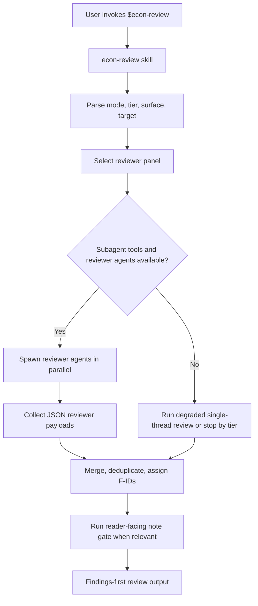

# Make `econ-review` Use Codex Subagent Review Panels

## Summary

This plan restructures the review package so `econ-review` remains the user-facing orchestrator, while reviewer lenses run as Codex custom subagents by default. The v1 package stays a simple GitHub repo install, with shared reviewer rules in one protocol reference and clear degraded behavior when subagents are unavailable.

---

## Problem Frame

The copied package initially exposed `econ-review` and `econ-reviewer` as skills. That captures the intended economist review panel concept, but it does not match Codex's current architecture cleanly: skills are reusable workflow instructions, while custom agents are the narrow, spawned sessions that do parallel review work. OpenAI's subagent docs also make an important behavioral point: Codex does not spawn subagents automatically unless the user or workflow explicitly asks for subagent work.

For first-time users of this shared package, direct invocation of `$econ-review` should therefore be unambiguous. It should mean: select an economist review panel, try to spawn the reviewer agents, merge their structured findings, and only fall back to a degraded single-thread review when the environment cannot support the panel.

---

## Requirements

- R1. Direct invocation of `$econ-review` must mean "try to run the economist review panel with subagents."
- R2. `econ-review` remains the only normal user-facing review skill.
- R3. Reviewer lenses should be represented as Codex custom agents, not as separate user-invoked skills.
- R4. Shared reviewer behavior must live in one protocol reference: JSON schema, evidence rules, taxonomy, role catalogue, and merge expectations.
- R5. The package must remain installable as a simple repository package for a few collaborators.
- R6. Fallback behavior must be visible and tier-aware; degraded review should never be mistaken for a full panel.
- R7. The plan must not redesign `econ-plan` or `econ-work` beyond any small documentation cross-references needed for the new review flow.
- R8. No implementation changes should be made until this plan is explicitly approved.

---

## Scope Boundaries

- In scope: review architecture, reviewer protocol extraction, project-scoped custom agent files, `econ-review` orchestration instructions, packaging documentation, and validation examples.
- In scope: removing `econ-reviewer` from the normal user-facing install surface after its durable content is moved into the protocol and agent definitions.
- Deferred to follow-up work: turning this repo into a full Codex plugin.
- Deferred to follow-up work: CI for validating skill metadata, TOML syntax, or install packaging.
- Out of scope: changing empirical review methodology, severity definitions, or role catalogue except where needed to make subagent dispatch clear.
- Out of scope: changing the original local skills outside this repository.

---

## High-Level Technical Design

The package should use a three-layer review architecture:

1. `econ-review` skill: orchestrates the whole review.
2. Custom reviewer agents: run one role-specific read-only lens each.
3. Shared reviewer protocol: keeps common rules stable across agents and the parent skill.

---

## Key Technical Decisions

- D1. Use one custom agent file per reviewer role. This follows OpenAI's guidance that the best custom agents are narrow and opinionated.
- D2. Keep `econ-review` as the orchestrator skill, not a custom agent. Skills are the right place for reusable workflow logic, progressive disclosure, and user-facing invocation.
- D3. Move common reviewer rules into `references/reviewer-protocol.md`. This prevents role TOML files from duplicating a long JSON contract and keeps changes auditable.
- D4. Remove `skills/econ-reviewer/` from the default install path. Its current content should be moved into the shared protocol and role-specific custom agents.
- D5. Do not pin a model in the v1 custom agent files unless implementation research shows this is needed. Prefer inherited model settings plus `sandbox_mode = "read-only"` and high reasoning for reviewer agents.
- D6. Keep v1 as a repo package. The README should document copying skill folders and reviewer TOML files; plugin packaging remains later work.
- D7. Make degradation explicit. A `promotion` review without subagents should be labelled insufficient for promotion unless the user explicitly accepts the degraded mode.

---

## Implementation Units

- U1. **Extract the shared reviewer protocol**

**Goal:** Move durable common reviewer rules out of the user-facing `econ-reviewer` skill and into one shared reference.

**Requirements:** R3, R4

**Dependencies:** None

**Files:**
- Create: `references/reviewer-protocol.md`
- Read from: `skills/econ-reviewer/SKILL.md`
- Modify later if retained: `skills/econ-reviewer/SKILL.md`

**Approach:**
- Preserve the existing role catalogue, JSON output contract, finding taxonomy, diagnostic gap contract, and hard rules.
- Remove language that frames the protocol as a normal user-invoked skill.
- Make the protocol readable by both `econ-review` and custom agents.

**Patterns to follow:**
- Existing role catalogue and JSON schema in `skills/econ-reviewer/SKILL.md`.
- Existing review matrix in `skills/econ-review/references/review_reference.md`.

**Test scenarios:**
- Happy path: a reviewer agent can read the protocol and know its role, surface, evidence order, JSON schema, and hard rules.
- Edge case: a role with no findings still returns a valid empty JSON payload.
- Error path: malformed or evidence-free findings are clearly disallowed by the protocol.

**Verification:**
- The protocol contains all allowed severity, trust effect, issue origin, fix class, and issue follow-up values.
- No protocol text depends on a private path, project name, or local workflow.

---

- U2. **Add Codex custom reviewer agents**

**Goal:** Provide project-scoped reviewer agents that Codex can spawn for each economist review lens.

**Requirements:** R1, R3, R5

**Dependencies:** U1

**Files:**
- Create: `.codex/agents/econ-provenance-reviewer.toml`
- Create: `.codex/agents/econ-specification-reviewer.toml`
- Create: `.codex/agents/econ-transformation-sample-reviewer.toml`
- Create: `.codex/agents/econ-output-consistency-reviewer.toml`
- Create: `.codex/agents/econ-claim-discipline-reviewer.toml`
- Create as needed for conditional roles: `.codex/agents/econ-estimation-practice-reviewer.toml`, `.codex/agents/econ-design-reviewer.toml`, `.codex/agents/econ-dynamics-reviewer.toml`, `.codex/agents/econ-robustness-reviewer.toml`, `.codex/agents/econ-reproducibility-reviewer.toml`, `.codex/agents/econ-software-equivalence-reviewer.toml`, `.codex/agents/econ-hybrid-implementation-reviewer.toml`, `.codex/agents/econ-bundle-reviewer.toml`
- Reference: `references/reviewer-protocol.md`

**Approach:**
- Each agent should be read-only, role-specific, and instructed to return JSON only.
- Each agent should point to the shared protocol and constrain itself to one assigned reviewer role.
- Core agents should cover the default panel. Conditional agents should cover the role matrix already used by `econ-review`.

**Patterns to follow:**
- OpenAI Codex custom agent docs for standalone TOML files under `.codex/agents/`.
- Existing role definitions in `skills/econ-reviewer/SKILL.md`.

**Test scenarios:**
- Happy path: default `surface:results` panel has all core custom agents available.
- Edge case: a `surface:plan` review selects a smaller panel and does not require all results-review agents.
- Error path: if a conditional agent is missing, `econ-review` reports which role was skipped or degraded.

**Verification:**
- Every TOML file has `name`, `description`, and `developer_instructions`.
- Reviewer agents are read-only and do not instruct themselves to mutate files.
- Role names match the role matrix used by `econ-review`.

---

- U3. **Update `econ-review` orchestration instructions**

**Goal:** Make the parent skill explicitly attempt subagent dispatch by default and define the parent-only responsibilities.

**Requirements:** R1, R2, R4, R6

**Dependencies:** U1, U2

**Files:**
- Modify: `skills/econ-review/SKILL.md`
- Modify: `skills/econ-review/references/review_reference.md`

**Approach:**
- Update the direct invocation contract so `$econ-review` means "try to run the subagent panel."
- Separate parent responsibilities from reviewer responsibilities:
  - parent parses target, tier, surface, and mode;
  - parent selects roles;
  - parent spawns reviewer agents when available;
  - parent waits for results;
  - parent validates JSON payloads;
  - parent merges, deduplicates, assigns finding IDs, and writes final output.
- Add a clear fallback matrix:
  - `tier:quick`: degraded single-thread review may proceed if labelled.
  - `tier:standard`: degraded review may proceed with a warning when subagents are unavailable.
  - `tier:promotion`: stop or require explicit user acceptance before degraded review.

**Patterns to follow:**
- Existing Stage 2 and Stage 3 panel-selection workflow in `skills/econ-review/SKILL.md`.
- OpenAI subagent guidance that subagents are suitable for parallel read-heavy review work and should return distilled summaries, not raw logs.

**Test scenarios:**
- Happy path: `$econ-review surface:results target` selects core roles, spawns reviewer agents, and synthesizes findings.
- Edge case: `$econ-review surface:plan mode:headless plan:<path>` uses a smaller panel and labels the verdict as reviewability, not output certification.
- Error path: subagent tools unavailable under `tier:promotion`; parent refuses to call the result a full promotion review.
- Error path: one reviewer returns malformed JSON; parent discards or quarantines that payload and reports degraded coverage.

**Verification:**
- Direct invocation behavior is stated near the top of `skills/econ-review/SKILL.md`.
- Parent and reviewer responsibilities are not mixed.
- The skill no longer implies that `econ-reviewer` is a normal skill subagent if the architecture has moved to custom agents.

---

- U4. **Remove the user-facing `econ-reviewer` skill**

**Goal:** Remove ambiguity about whether first-time users should directly invoke `econ-reviewer`.

**Requirements:** R2, R3, R5

**Dependencies:** U1, U2, U3

**Files:**
- Remove from install surface: `skills/econ-reviewer/SKILL.md`
- Modify: `README.md`

**Approach:**
- Remove `skills/econ-reviewer/` from README installation instructions after its durable content is moved.
- Do not leave it described as one of the four normal end-user skills once custom agents exist.

**Patterns to follow:**
- README's current concise skill descriptions.

**Test scenarios:**
- Happy path: a first-time user reading README understands they invoke `econ-review`, not `econ-reviewer`.
- Edge case: a user installs only the skill folders and skips `.codex/agents/`; README makes clear this means the full review panel will be unavailable.

**Verification:**
- README no longer presents `econ-reviewer` as a normal installed skill.
- Search results for `econ-reviewer` distinguish retired source/protocol usage from user-facing invocation.

---

- U5. **Update package installation and contributor documentation**

**Goal:** Make installation clear for both skills and custom agents in a simple repo-package workflow.

**Requirements:** R5, R6

**Dependencies:** U2, U3, U4

**Files:**
- Modify: `README.md`
- Optionally create: `docs/install.md`
- Optionally create: `docs/examples/econ-review.md`

**Approach:**
- Document the v1 install flow:
  - copy `econ-plan`, `econ-work`, and `econ-review` skill folders into the user's Codex skills location;
  - copy reviewer TOML files into either a user-level agent directory or a project `.codex/agents/` directory;
  - restart Codex if needed.
- Explain that direct `$econ-review` runs the panel when subagent support is available.
- Include a short degraded-mode explanation so users know what happened when they see a fallback message.

**Patterns to follow:**
- Current `README.md` structure and plain-language style.
- OpenAI docs distinction between skills, plugins, and custom agents.

**Test scenarios:**
- Happy path: collaborator follows README and installs the orchestrator skill plus reviewer agents.
- Edge case: collaborator installs only skills; README explains why full panel review will be unavailable.
- Error path: collaborator runs a promotion review without agents; expected behavior is clear from docs.

**Verification:**
- README remains concise.
- Installation docs do not include private local paths.
- No license text is added unless separately approved.

---

- U6. **Add lightweight validation examples**

**Goal:** Give future implementers and reviewers concrete checks without building a full CI system.

**Requirements:** R1, R4, R6

**Dependencies:** U3, U5

**Files:**
- Optionally create: `docs/examples/econ-review.md`
- Optionally create: `docs/checklists/review-panel-validation.md`

**Approach:**
- Add example invocations for `surface:plan`, `surface:results`, `surface:bundle`, and `tier:promotion`.
- Add expected behavior notes for full-panel, partial-panel, and no-subagent cases.
- Keep examples generic and economist-native.

**Patterns to follow:**
- Existing review surfaces in `skills/econ-review/SKILL.md`.
- Existing headless output envelope in `skills/econ-review/references/review_reference.md`.

**Test scenarios:**
- Happy path: examples show selected roles and panel synthesis behavior.
- Edge case: example explains plan reviewability versus realised-output certification.
- Error path: examples show degraded review disclosure.

**Verification:**
- Examples are free of private project names and local paths.
- Examples do not claim that empirical outputs were reviewed without evidence.

---

## System-Wide Impact

- **Skill surface:** `econ-review` becomes the only normal review skill users need to invoke.
- **Agent surface:** `.codex/agents/` becomes part of the package's functional install surface.
- **Documentation surface:** README must teach first-time users the difference between installing skills and installing reviewer agents.
- **Review semantics:** A review result must distinguish full panel review from degraded fallback review.
- **First-pass onboarding:** The package should read as a clean first install, with no assumption that collaborators already have earlier versions.

---

## Risks & Mitigations

| Risk | Mitigation |
| --- | --- |
| First-time users install only the skills and miss the reviewer agents. | README explicitly separates skill installation from agent installation and describes degraded behavior. |
| `econ-reviewer` remains visible and confuses users. | Remove it from the default install surface and keep README focused on invoking `econ-review`. |
| Agent TOML files duplicate too much protocol text and drift. | Keep shared rules in `references/reviewer-protocol.md`; each agent file stays narrow. |
| Promotion reviews run in degraded mode without the user realizing. | `econ-review` must stop or require explicit acceptance before degraded `tier:promotion` review. |
| OpenAI agent file format evolves. | Keep custom agent files simple and documented; avoid overusing optional fields. |
| The plan overfits this packaging repo rather than collaborators' empirical repos. | Document both project-level and user-level agent installation options. |

---

## Documentation / Operational Notes

- The README should keep the repo private/public status and license decision separate from the architecture change.
- The plan should not introduce a `LICENSE`.
- Public sharing later should include a fresh audit for local paths, private project names, and project-specific assumptions.
- Plugin packaging is a natural follow-up after the repo-package v1 has been tested with collaborators.

---

## Validation Checklist

- `econ-review` direct invocation says it will try to run a subagent panel.
- The default panel includes provenance and specification reviewers.
- Results, bundle, note, diff, and mixed reviews select the appropriate additional reviewers.
- Every reviewer custom agent is read-only and JSON-only.
- The parent skill owns merging and deduplication.
- Degraded review paths are labelled in the final output.
- `tier:promotion` cannot silently downgrade to single-thread review.
- README installation covers both skills and custom agents.
- No original local skill folders are edited during implementation.

---

## Sources & References

- OpenAI Codex subagent concepts: https://developers.openai.com/codex/concepts/subagents
- OpenAI Codex custom subagents: https://developers.openai.com/codex/subagents
- OpenAI Codex skills: https://developers.openai.com/codex/skills
- Current orchestrator skill: `skills/econ-review/SKILL.md`
- Current reviewer protocol source: `skills/econ-reviewer/SKILL.md`
- Current review reference: `skills/econ-review/references/review_reference.md`
- Current package README: `README.md`
