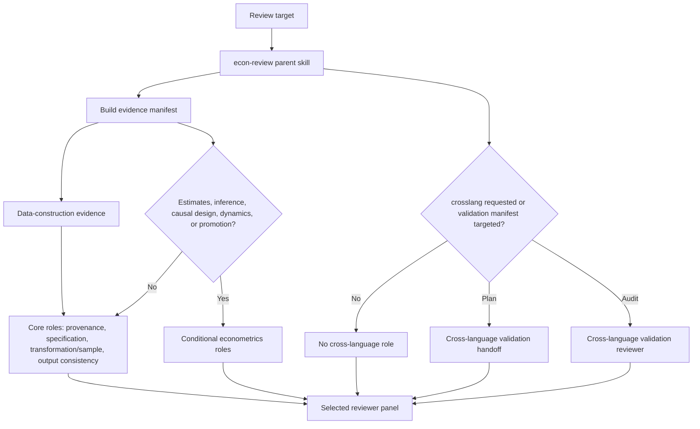
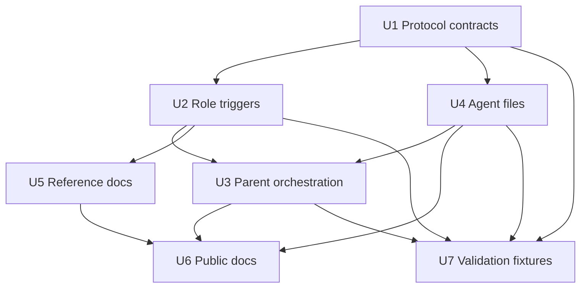

# feat: Add Conditional Econometrics Reviewers

## Summary

Implement the GPT Pro recommendations as a minimal, evidence-triggered upgrade to `econ-review`: strengthen the shared protocol with data-construction and econometric evidence contracts, add a few optional reviewer agents, and keep the default panel data-cleaning-first. The implementation should make regression/econometrics reviewers available when the evidence surface warrants them, not force them into every empirical review.

---

## Problem Frame

The current `econ-review` panel already covers the basic empirical trust structure: provenance, specification, transformation/sample, output consistency, interpretation, reproducibility, and bundle quality. GPT Pro's useful critique is that the econometrics side is under-specified, but the user's concern is also correct: much of the workflow is upstream data cleaning, construction, and documentation rather than regression review. The plan therefore treats econometrics as a conditional expansion, while making the data-construction path more explicit and better protected.

---

## Requirements

- R1. Preserve `econ-review` as the single user-facing review skill and parent orchestrator.
- R2. Keep the default review panel data-cleaning-first: provenance, specification, transformation/sample, and output consistency remain the core roles for non-plan empirical reviews.
- R3. Add a shared data-construction evidence contract so cleaning-heavy work is not treated as a weak or secondary case.
- R4. Add a shared econometric evidence contract for realised estimates, inferential claims, causal designs, dynamic outputs, or promotion-grade result surfaces.
- R5. Add optional reviewer roles for inference, output perception, and cross-language validation without making them default for every review.
- R6. Make cross-language validation explicitly opt-in through `crosslang:no|yes|plan|audit`; never silently require it.
- R7. Keep reviewer TOML files thin and role-specific; shared rules belong in `references/reviewer-protocol.md`.
- R8. Update installation and examples so collaborators understand which reviewers are core and which are conditional.
- R9. Add lightweight validation fixtures or schemas so the upgraded role-selection behavior can be checked without a full empirical repo.
- R10. Do not touch original local Codex skill folders outside this repository.

---

## Scope Boundaries

- Do not create method-specific reviewer agents for DiD, IV, RD, RCT, synthetic control, matching/IPW, or local projections in this pass.
- Do not make cross-language validation part of ordinary review.
- Do not create validation scripts that rerun analysis in R, Stata, or Python.
- Do not import MixtapeTools wholesale or adopt Claude-specific directory conventions.
- Do not rewrite the package into a Codex plugin in this pass.
- Do not change `econ-plan` or `econ-work` except for small documentation cross-references if implementation reveals they are necessary.

### Deferred to Follow-Up Work

- Full plugin packaging: evaluate after this repository package is tested.
- Method-specific reviewer split: consider only if the general `design-auditor` or `inference-auditor` becomes overloaded in real reviews.
- Automated CI for schema validation: useful later, but not required for this small collaborator package.

---

## Context & Research

### Relevant Code and Patterns

- `skills/econ-review/SKILL.md`: parent skill contract, input parsing, evidence gathering, role selection, subagent dispatch, fallback behavior, and final synthesis.
- `skills/econ-review/references/review_reference.md`: detailed read order, role matrix, custom-agent mapping, fallback matrix, taxonomy, and headless envelope.
- `references/reviewer-protocol.md`: shared JSON contract and role catalogue for all reviewer agents.
- `.codex/agents/*.toml`: one read-only custom reviewer agent per role.
- `docs/examples/econ-review.md`: generic examples for users.
- `docs/checklists/review-panel-validation.md`: package validation checklist.

### Institutional Learnings

- No relevant `docs/solutions/` learning files are present in this repository.

### External References

- GPT Pro return package reviewed on 2026-05-07: recommends a protocol-first econometrics upgrade, an inference reviewer, an output-perception reviewer, and opt-in cross-language validation.
- MixtapeTools prior art: https://github.com/scunning1975/MixtapeTools/tree/main
- OpenAI Codex custom subagents documentation: https://developers.openai.com/codex/subagents
- OpenAI Codex skills documentation: https://developers.openai.com/codex/skills

---

## Key Technical Decisions

- **Implement a minimal conditional upgrade rather than copying the GPT Pro overlay wholesale:** The overlay is useful, but direct replacement would risk overfitting the package toward regression review and could obscure the core data-cleaning use case.
- **Add a data-construction evidence contract before the econometric evidence contract:** This makes joins, filters, missingness, support, denominators, weights, and sample accounting first-class review evidence.
- **Split inference from estimation practice:** `estimation-practice-auditor` should own model implementation details; a new `inference-auditor` should own uncertainty, clustering, small samples, weak-IV inference, confidence bands, and multiplicity.
- **Add output perception as a separate visible-output lens:** This adapts MixtapeTools/Blindspot without confusing it with claim discipline. It asks what tables and figures visibly show or omit before deciding whether prose overclaims.
- **Keep cross-language validation opt-in:** Cross-language work is powerful but expensive. The package should support planning or auditing it when requested, not make it a default obligation.
- **Use frontier econometric sources as guardrails, not runtime literature review:** Source cards should remind reviewers what failure modes matter for each method, but ordinary `econ-review` runs should remain evidence-led and bounded.
- **Keep TOML agents thin:** Each custom agent should point to the shared protocol and its assigned role; detailed schemas and method rules should not be duplicated across TOML files.

---

## Open Questions

### Resolved During Planning

- Should the econometrics agents always run? No. They should be selected only when realised estimates, inferential claims, causal designs, dynamic outputs, robustness disputes, or explicit cross-language requests are visible.
- Should data-cleaning work get weaker coverage? No. The implementation should strengthen the data-construction path and keep it central.
- Should method-specific agents be created now? No. Add method guardrails to the protocol first; split later only if real use shows the broad design/inference reviewers are overloaded.

### Deferred to Implementation

- Exact wording reuse from the GPT Pro overlay: adapt manually during implementation so the final text fits this package's tone and current structure.
- Final location for validation fixtures: prefer `docs/validation/` unless implementation shows root-level `validation_fixtures/` is clearer.
- Whether schema files should be root-level `schemas/` or documentation-only examples: decide when adding validation material, keeping install simplicity in mind.

---

## Output Structure

```text
.codex/
  agents/
    econ-inference-reviewer.toml
    econ-output-perception-reviewer.toml
    econ-cross-language-validation-reviewer.toml
skills/
  econ-review/
    references/
      cross_language_validation_workflow.md
      frontier_source_cards.md
docs/
  validation/
    econometrics-panel-fixtures.md
schemas/
  econometric_evidence_manifest.schema.json
  cross_language_validation_manifest.schema.json
```

The tree shows expected new surfaces. Existing files such as `references/reviewer-protocol.md`, `skills/econ-review/SKILL.md`, `skills/econ-review/references/review_reference.md`, `README.md`, and existing agent TOML files will also be modified.

---

## High-Level Technical Design

> *This illustrates the intended approach and is directional guidance for review, not implementation specification. The implementing agent should treat it as context, not code to reproduce.*



---

## Implementation Units

- U1. **Strengthen the Shared Reviewer Protocol**

**Goal:** Make the shared protocol cover both data-construction evidence and econometric evidence without turning every review into a regression review.

**Requirements:** R2, R3, R4, R7

**Dependencies:** None

**Files:**
- Modify: `references/reviewer-protocol.md`
- Test: `docs/validation/econometrics-panel-fixtures.md`
- Test: `schemas/econometric_evidence_manifest.schema.json`

**Approach:**
- Add a `Data Construction Evidence Contract` that covers lineage, joins, keys, merge cardinality, reason-coded drops, missingness, supports, denominators, weights, timing alignment, and sample accounting.
- Add an `Econometric Evidence Contract` that activates only when realised estimates, model-based descriptives, causal claims, dynamic responses, inferential claims, or promotion-grade result surfaces are in scope.
- Add role catalogue entries for `inference-auditor`, `output-perception-auditor`, and `cross-language-validation-auditor`.
- Refine existing role descriptions so `estimation-practice-auditor` no longer owns all inference questions, and `software-equivalence-auditor` remains separate from opt-in cross-language validation.
- Keep method guardrails concise and evidence-led.

**Patterns to follow:**
- Existing role catalogue and JSON output contract in `references/reviewer-protocol.md`.
- GPT Pro's protocol-first recommendation, adapted rather than copied wholesale.

**Test scenarios:**
- Happy path: a data-cleaning review with joins, filters, and missingness but no estimates uses the data-construction contract and does not produce irrelevant inference gaps.
- Happy path: an event-study result with confidence intervals activates econometric evidence and inference duties.
- Edge case: a note that cites a descriptive table but makes no causal or inferential claim still checks sample, denominators, and output consistency without requiring a full design audit.
- Error path: missing key diagnostics, sample accounting, or denominator rules are reported as diagnostic gaps rather than soft caveats.

**Verification:**
- The protocol names both data-construction and econometric evidence surfaces.
- Role descriptions have clear boundaries and do not duplicate the same question across multiple agents.
- The JSON contract still supports all existing reviewer payloads.

---

- U2. **Update Role Selection and Trigger Rules**

**Goal:** Make the parent role matrix choose optional econometrics reviewers only when evidence warrants them.

**Requirements:** R1, R2, R4, R5, R6

**Dependencies:** U1

**Files:**
- Modify: `skills/econ-review/references/review_reference.md`
- Test: `docs/validation/econometrics-panel-fixtures.md`

**Approach:**
- Keep `provenance-auditor` and `specification-auditor` always-on.
- Keep `transformation-and-sample-auditor` and `output-consistency-auditor` as the default non-plan empirical core.
- Add `inference-auditor` triggers for p-values, confidence intervals, stars, clustered designs, IV/RD/RCT, event studies, local projections, dynamic outputs, multiple outcomes/treatments/horizons, and promotion-grade causal work.
- Add `output-perception-auditor` triggers for table/figure-heavy results, note-facing outputs, visible anomalies, and promotion-grade interpretation.
- Add `cross-language-validation-auditor` only for explicit `crosslang:yes|plan|audit`, a targeted validation manifest, or explicit cross-language equivalence claims.
- Expand the issue-origin taxonomy and custom-agent mapping for new roles.
- Update typical panel sizes so data-cleaning reviews remain compact and promotion-grade results can become larger.

**Patterns to follow:**
- Existing reviewer-role matrix in `skills/econ-review/references/review_reference.md`.
- Existing fallback matrix and headless envelope in the same file.

**Test scenarios:**
- Happy path: `surface:results` over cleaning outputs selects core data roles but not inference.
- Happy path: `surface:results tier:promotion` over a regression table with confidence intervals selects `inference-auditor`.
- Happy path: `surface:note interpretation:yes` over figure-heavy outputs selects `output-perception-auditor` and `claim-discipline-auditor`.
- Edge case: a repository containing both Stata and Python files does not select cross-language validation unless equivalence is claimed or `crosslang:` is requested.
- Error path: `crosslang:audit` with no manifest returns a diagnostic gap or handoff requirement rather than pretending validation has run.

**Verification:**
- The matrix can explain why every selected reviewer is present.
- The matrix can explain why econometrics reviewers are absent in cleaning-only reviews.
- New role names match the custom-agent names added in U4.

---

- U3. **Patch Parent `econ-review` Orchestration**

**Goal:** Teach the parent skill to parse cross-language intent, build richer evidence manifests, and dispatch the upgraded panel without changing the user-facing contract.

**Requirements:** R1, R2, R3, R4, R5, R6

**Dependencies:** U1, U2

**Files:**
- Modify: `skills/econ-review/SKILL.md`
- Test: `docs/validation/econometrics-panel-fixtures.md`

**Approach:**
- Add `crosslang:no|yes|plan|audit` to input parsing, defaulting to `crosslang:no`.
- Extend Stage 1 evidence gathering to build a compact manifest with separate `data_construction_evidence` and conditional `econometric_evidence` blocks.
- Make unknown fields explicit as missing or unknown; the parent should not infer details that are not visible.
- Update Stage 2 to use the revised role matrix and announce when econometrics roles are intentionally absent.
- Update Stage 3 reviewer prompts so new roles receive the same protocol excerpt, evidence manifest, read order, JSON contract, and no-mutation boundaries.
- Add parent behavior for `crosslang:plan`: produce a separate validation handoff section and clearly say validation has not run.

**Patterns to follow:**
- Existing Stage 1 evidence manifest behavior in `skills/econ-review/SKILL.md`.
- Existing Stage 3 subagent prompt requirements in `skills/econ-review/SKILL.md`.

**Test scenarios:**
- Happy path: cleaning-heavy `surface:diff` builds data-construction evidence and dispatches the core data reviewers only.
- Happy path: inferential `surface:results` builds econometric evidence and dispatches `inference-auditor`.
- Happy path: `crosslang:plan` returns a validation handoff section without selecting a full equivalence audit over nonexistent scripts.
- Edge case: missing model-spec ledger in a non-regression cleaning review is not treated as a regression-specific blocker.
- Error path: `tier:promotion` with missing configured new agents follows degraded-panel rules rather than silently calling the review complete.

**Verification:**
- Direct invocation still means "try the subagent review panel."
- The fallback rules still behave by tier.
- Review output makes selected and omitted reviewer roles understandable to the user.

---

- U4. **Add Optional Reviewer Agent Files**

**Goal:** Add the new conditional custom agents and lightly adjust existing agent descriptions where boundaries changed.

**Requirements:** R5, R6, R7

**Dependencies:** U1, U2

**Files:**
- Create: `.codex/agents/econ-inference-reviewer.toml`
- Create: `.codex/agents/econ-output-perception-reviewer.toml`
- Create: `.codex/agents/econ-cross-language-validation-reviewer.toml`
- Modify: `.codex/agents/econ-estimation-practice-reviewer.toml`
- Modify: `.codex/agents/econ-design-reviewer.toml`
- Modify: `.codex/agents/econ-dynamics-reviewer.toml`
- Modify: `.codex/agents/econ-robustness-reviewer.toml`
- Modify: `.codex/agents/econ-software-equivalence-reviewer.toml`
- Test: `docs/validation/econometrics-panel-fixtures.md`

**Approach:**
- Keep each TOML file narrow: `name`, `description`, `model_reasoning_effort`, `sandbox_mode`, and concise `developer_instructions`.
- New agents should prefer the parent-supplied protocol excerpt and evidence manifest, then the installed protocol path, matching existing convention.
- Existing econometrics-adjacent agents should be adjusted only enough to avoid overlap with the new inference and cross-language roles.
- Do not duplicate long protocol text in TOML files.

**Patterns to follow:**
- Existing `.codex/agents/econ-*-reviewer.toml` files.
- Existing read-only and JSON-only boundaries.

**Test scenarios:**
- Happy path: all new TOML files parse successfully and expose expected agent names.
- Happy path: `inference-auditor` instructions focus on uncertainty, not full estimator implementation.
- Happy path: `output-perception-auditor` instructions focus on visible anomalies and absences, not code correctness.
- Edge case: `cross-language-validation-auditor` instructions refuse to create scripts and return planning or audit gaps in JSON.

**Verification:**
- All TOML files remain read-only.
- Agent names match `review_reference.md`.
- No agent tells itself to mutate files, create issues, or write prose outside JSON.

---

- U5. **Add Cross-Language and Frontier Guardrail References**

**Goal:** Provide bounded supporting references for opt-in cross-language validation and method guardrails.

**Requirements:** R4, R5, R6, R7

**Dependencies:** U1, U2, U3

**Files:**
- Create: `skills/econ-review/references/cross_language_validation_workflow.md`
- Create: `skills/econ-review/references/frontier_source_cards.md`
- Modify: `skills/econ-review/references/review_reference.md`
- Test: `docs/validation/econometrics-panel-fixtures.md`

**Approach:**
- `cross_language_validation_workflow.md` should explain how to plan or audit validation without creating scripts inside `econ-review`.
- `frontier_source_cards.md` should be short source cards: method, common failure modes, reviewer guardrails, and when to escalate.
- Keep both references optional and parent-owned; reviewer agents should not independently browse or turn every review into a literature review.

**Patterns to follow:**
- Existing reference-file style under `skills/econ-review/references/`.
- GPT Pro's "guardrails, not runtime literature review" recommendation.

**Test scenarios:**
- Happy path: `crosslang:plan` can point to a handoff template with object parity, numeric comparison, and independence boundaries.
- Happy path: a DiD/event-study review can use source-card guardrails to identify support, comparison-group, and contamination gaps.
- Edge case: a cleaning-only review never needs to read frontier source cards.

**Verification:**
- References are concise enough to be useful during skill invocation.
- Cross-language guidance preserves opt-in behavior.
- Source cards do not create a requirement for external literature review during normal `econ-review`.

---

- U6. **Update Public Package Documentation**

**Goal:** Make the new behavior understandable to first-time users and future collaborators.

**Requirements:** R2, R5, R6, R8

**Dependencies:** U1, U2, U3, U4, U5

**Files:**
- Modify: `README.md`
- Modify: `docs/examples/econ-review.md`
- Modify: `docs/checklists/review-panel-validation.md`
- Test: `docs/validation/econometrics-panel-fixtures.md`

**Approach:**
- Explain that data-construction reviewers are the default core for empirical work.
- Explain that inference, output perception, and cross-language validation are conditional roles.
- Add examples for cleaning-heavy reviews, regression/inference reviews, note-facing visible-output reviews, and cross-language planning/audit.
- Update installation docs so new `.codex/agents/*.toml` files are included.
- Keep language economist-native rather than developer-heavy.

**Patterns to follow:**
- Current README structure and concise skill descriptions.
- Existing examples in `docs/examples/econ-review.md`.

**Test scenarios:**
- Happy path: a first-time user can tell how to request a cleaning-heavy review.
- Happy path: a first-time user can tell why `crosslang:` is opt-in.
- Edge case: a user installing only skills, not agents, understands that the review panel will be degraded.

**Verification:**
- Documentation does not imply all econometrics agents always run.
- Documentation contains no private paths or project-specific assumptions.
- README remains concise.

---

- U7. **Add Lightweight Validation Fixtures and Schemas**

**Goal:** Make the upgraded package checkable without needing a full empirical project.

**Requirements:** R9, R10

**Dependencies:** U1, U2, U3, U4

**Files:**
- Create: `docs/validation/econometrics-panel-fixtures.md`
- Create: `schemas/econometric_evidence_manifest.schema.json`
- Create: `schemas/cross_language_validation_manifest.schema.json`
- Modify: `docs/checklists/review-panel-validation.md`

**Approach:**
- Add fixture scenarios that exercise role selection: cleaning-only, event study, IV, RD, cluster-randomized trial, synthetic control, local projections, IPW/overlap, output-perception anomaly, cross-language audit, and cross-language planning.
- Add compact JSON schemas as documentation and validation aids, not as a required runtime dependency.
- Extend the checklist to cover TOML parsing, role mapping, optional-role triggers, no personal paths, and no original-skill edits.

**Patterns to follow:**
- Existing `docs/checklists/review-panel-validation.md`.
- GPT Pro's fixture and schema suggestions, adapted into this repository's documentation style.

**Test scenarios:**
- Happy path: each fixture names expected reviewers and expected diagnostic gaps.
- Happy path: schemas include the fields the parent is expected to pass without requiring every field to be present.
- Edge case: cleaning-only fixture proves inference and cross-language roles are not selected.
- Error path: cross-language requested without a manifest produces a planned handoff, not a false audit.

**Verification:**
- A maintainer can trace every new role to at least one fixture.
- Schema files are syntactically valid JSON.
- Validation docs remain generic and free of private project names.

---

## Dependency Graph



---

## System-Wide Impact

- **Skill interface:** `econ-review` gains a `crosslang:` token and clearer evidence-triggered role selection.
- **Agent surface:** the package grows from 13 reviewer agents to 16 reviewer agents, but only the core data roles remain default.
- **Protocol surface:** `references/reviewer-protocol.md` becomes more important because it carries both data-construction and econometric contracts.
- **Documentation surface:** README, examples, and validation checklist must explain that "more agents available" does not mean "all agents always run."
- **Review semantics:** cleaning-heavy work should receive stronger, not weaker, scrutiny after the upgrade.
- **Unchanged invariants:** reviewer agents remain read-only, JSON-only, and parent-orchestrated; `econ-review` remains the user-facing entrypoint.

---

## Risks & Dependencies

| Risk | Mitigation |
|------|------------|
| Econometrics additions make ordinary cleaning reviews noisy. | Keep role triggers evidence-based and add a cleaning-only fixture that proves inference/design/cross-language roles stay absent. |
| The GPT Pro overlay is copied too literally. | Treat it as source input; adapt manually to current repo structure and user priorities. |
| `inference-auditor` overlaps with `estimation-practice-auditor`. | Explicitly split implementation choices from uncertainty/inference choices in protocol, role matrix, and agent instructions. |
| Cross-language validation creates false expectations. | Default to `crosslang:no`; use `crosslang:plan` when validation is requested but not run. |
| Frontier source cards become bloated literature review instructions. | Keep cards short and frame them as guardrails for visible methods. |
| Collaborators forget to install the new agent files. | Update README install instructions and degraded-mode docs. |
| New schema or fixture files look like runtime requirements. | Document them as maintainer validation aids, not required install files. |

---

## Documentation / Operational Notes

- README should continue to present `econ-plan`, `econ-work`, and `econ-review` as the user-facing package.
- The docs should state that the panel is strongest when the review bundle includes diagnostics and manifests, but missing diagnostics are themselves review evidence.
- The package should not include a license file unless the user separately chooses one.
- Before public sharing, rerun the private-path and project-specific-assumption scan.

---

## Sources & References

- Current parent skill: `skills/econ-review/SKILL.md`
- Current role matrix: `skills/econ-review/references/review_reference.md`
- Current shared protocol: `references/reviewer-protocol.md`
- Current reviewer agents: `.codex/agents/`
- Current examples: `docs/examples/econ-review.md`
- Current validation checklist: `docs/checklists/review-panel-validation.md`
- Prior architecture plan: `docs/plans/2026-05-07-001-tech-econ-review-subagents-plan.md`
- MixtapeTools prior art: https://github.com/scunning1975/MixtapeTools/tree/main
- OpenAI Codex custom subagents: https://developers.openai.com/codex/subagents
- OpenAI Codex skills: https://developers.openai.com/codex/skills
