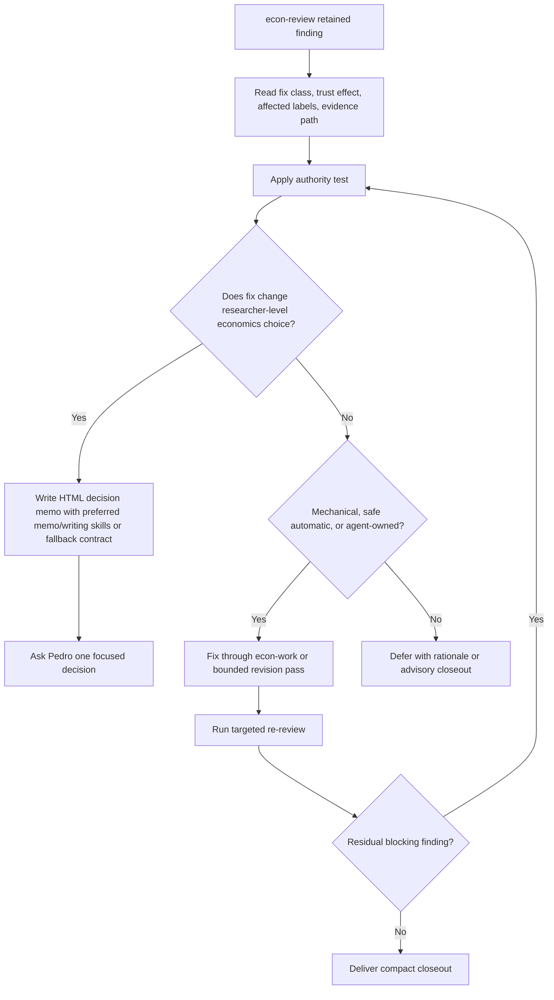

# feat: Strengthen econ-lfg review-resolution loop

## Summary

Implement Option 1 from the dynamic econ-agent loops memo by making `econ-lfg`'s review-resolution stage explicit enough to run the practical near-term loop: plan, work, review, fix straightforward or agent-owned findings, run targeted re-review, and deliver only when residual findings are resolved, consciously deferred, or require a real researcher-level decision.

---

## Problem Frame

The current `econ-lfg` skill already describes a goal-backed `econ-plan -> econ-work -> econ-review -> revision -> re-review` loop, but the autonomy boundary is still too compressed. It says to classify findings and pause for user-level economics decisions, yet it does not give the implementing agent a concrete enough rule for which review findings it may fix, which findings require Pedro, or how to present a blocked research choice without turning the interaction into software-workflow jargon.

---

## Assumptions

*This plan was authored without synchronous user confirmation. The items below are agent inferences that fill gaps in the input and should be reviewed before implementation proceeds.*

- The first implementation should stay focused on Option 1 only. Source-scouting, package-checking, repeated-mistake learning, and batch parallelisation remain follow-up options from the memo.
- The source skill remains the authority: edit `skills/econ-lfg/SKILL.md` and any new `skills/econ-lfg/references/` file first, then regenerate the Claude surfaces from source rather than hand-editing generated files.
- A small `econ-lfg` reference file is acceptable if it keeps `SKILL.md` readable and lets the classification table, Pedro-decision triggers, and decision-memo contract live in one maintained place.
- `econ-html-memo` and `econ-writing` are installed runtime skills on Pedro's Codex setup, not source skills in this repo. The implementation should reference them as preferred runtime skills, verify that they resolve in the target runtime when possible, and include an inline fallback decision-memo contract for runtimes where those skills are absent.
- No persistent test framework exists for these prompt/skill surfaces. Validation should follow the repo's current style: frontmatter checks, targeted text checks, source-to-generated parity checks, Python syntax checks for builder/install scripts, and a clean generated tree after `build_claude.py`.

---

## Requirements

- R1. `econ-lfg` must classify retained `econ-review` findings after the review stage using the finding's fix class, trust effect, affected labels, evidence path, and authority source.
- R2. `econ-lfg` must fix without asking when the finding is mechanical, safe automatic, or clearly agent-owned and the fix stays inside the initial prompt and saved plan.
- R3. `econ-lfg` must require Pedro for the canonical Pedro-level trigger list defined in U3, anchored to `econ-work` Class A choices and extended only where review, promotion, or handoff decisions materially change the research object.
- R4. When a Pedro-level decision arises, `econ-lfg` must write an economist-facing HTML decision memo before asking for the decision unless the blocker is so small that a one-question pause is obviously enough. On Pedro's Codex runtime, it should load `econ-html-memo` plus `econ-writing`; on runtimes where those skills are unavailable, it should follow the inline memo contract in this plan/reference instead of failing on a dangling skill dependency.
- R5. The decision memo must explain, in plain economics language, what decision arose, what outputs or review findings show, what Codex recommends and why, what changes under each choice, and what Codex will do next once Pedro decides.
- R6. `econ-lfg` must run targeted re-review after fixes and broaden review only when the fix changes the research object or primary output surface.
- R7. The implementation must preserve the economics workflow identity. It must not import Compound Engineering PR, CI, browser-test, deploy, or generic software-shipping behavior.
- R8. Validation must prove Codex source and generated Claude surfaces are in sync, including generated skill references if a new `skills/econ-lfg/references/` file is added.

---

## Scope Boundaries

- In scope: `econ-lfg` source-skill behavior, a focused review-resolution reference if useful, `econ-lfg` command prompt wording, and generated Claude package refresh.
- In scope: validation that generated Claude files match source after regeneration.
- Out of scope: changing `econ-plan`, `econ-work`, or `econ-review` behavior unless implementation reveals a wording mismatch that blocks `econ-lfg` integration.
- Out of scope: adding a general multi-agent/thread orchestration system.
- Out of scope: adding source-scouting, package-checking, repeated-mistake learning, batch splitting, or automatic durable learning capture.
- Out of scope: creating GitHub issues, commits, branches, or installer behavior changes unless the implementation unexpectedly adds new source surfaces that install/build scripts do not already cover.

### Deferred to Follow-Up Work

- Option 2 source-scouting loop for vague research and planning tasks.
- Option 3 package-checking loop for GPT Pro or coauthor handoffs.
- Option 4 reviewed maintenance habit for repeated workflow mistakes.
- Option 5 batch-splitting loop for large empirical jobs.

---

## Context & Research

### Relevant Code and Patterns

- `skills/econ-lfg/SKILL.md` is the canonical Codex source for the autonomous economics loop. It already includes the required stage order, authority hierarchy, review-resolution pass, targeted re-review, and hard stops.
- `skills/econ-lfg/agents/openai.yaml` drives the generated `/econ-lfg` Claude command prompt. If the default prompt needs to mention Pedro-decision memos or clearer autonomy boundaries, update this source file.
- `claude/skills/econ-lfg/SKILL.md` and `claude/commands/econ-lfg.md` are generated outputs with a "do not edit" banner.
- `build_claude.py` copies each source skill tree into `claude/skills/<name>/`, drops Codex-only `agents/openai.yaml`, rewrites Codex references into Claude references, and builds slash commands from `agents/openai.yaml`.
- `install.py` installs whole source skill trees into Codex home, so a new `skills/econ-lfg/references/` file should be included automatically without installer changes.
- `skills/econ-review/SKILL.md` already defines fix classes: `safe automatic`, `gated`, `manual`, and `advisory`. It also defines the safe auto-fix boundary and the decisions where the user must be asked.
- `skills/econ-work/SKILL.md` already defines Class A choices: estimand-defining, identification-defining, sample-boundary, baseline-defining, main-output, benchmark-treatment, and note-scope-defining choices.
- `skills/econ-plan/references/plan_template.md` already includes `note_type: decision-memo`, which aligns with the desired decision-memo handoff.

### Institutional Learnings

- Local memory and current repo text agree that `econ-lfg` should be an orchestration wrapper over `econ-plan`, `econ-work`, and `econ-review`, adding review-resolution and re-review rather than copying Compound Engineering's shipping loop.
- Prior validation for the `econ-lfg` addition used `build_claude.py`, Python syntax checks for installer/build scripts, frontmatter checks, install/build smoke checks, and targeted searches for `econ-lfg` and review-resolution wording.
- Recent SSJ planning artifacts reinforce the same economics boundary: stop for benchmark, model-map, comparison-target, or interpretation choices; do not let an implementation loop silently redefine the research object.

### External References

- No new external research is needed for this implementation plan. The origin memo already distilled the public agent-loop discussion; this plan only turns the selected local option into repo-specific work.

---

## Key Technical Decisions

- Put the decision logic in `econ-lfg`, not in `econ-review`: `econ-review` should report findings, fix classes, trust effects, and evidence. `econ-lfg` owns whether to fix, defer, re-review, or ask Pedro because it sees the whole plan-work-review loop.
- Use a four-way authority test before any fix: researcher-anchored choice, plan-backed choice, agent-owned choice, or execution-discovered fact. This keeps automatic fixes from overriding the user's research choices.
- Treat review findings as evidence, not orders. A finding can justify automatic cleanup or a decision memo, but it cannot by itself change the baseline, sample, estimand, identification, benchmark, output promotion, or interpretation.
- Create a reusable review-resolution reference if the classification table becomes too long for `SKILL.md`. This keeps the main skill readable while preserving a concrete contract for implementers.
- Decision memos should be evidence-first and economist-facing. They should use `econ-html-memo` for document shape and validation, and `econ-writing` for prose discipline when those installed skills are available, with the inline memo contract as the fallback. They should not become dashboards, engineering reports, or execution logs.
- Treat `econ-html-memo` and `econ-writing` as preferred installed-skill dependencies, not repo-owned source files. The source text should say what to do when they are unavailable, especially on generated Claude surfaces.
- Generated Claude files should be refreshed in the same implementation if source changes land. The generated tree is part of the committed surface for this repo.

---

## Open Questions

### Resolved During Planning

- Should this plan add a new top-level "dynamic loops" skill? No. The origin memo recommends starting by clarifying `econ-lfg`'s review cycle.
- Should `econ-lfg` auto-fix all review findings marked `safe automatic`? Yes, unless the local authority test shows the fix would still change a researcher-anchored choice or promoted output boundary.
- Should `econ-lfg` ask Pedro in chat immediately when a hard decision arises? Usually no. For non-trivial decisions, it should first write a compact economist-facing HTML decision memo so Pedro sees the evidence and recommendation before deciding.
- Should generated Claude surfaces be edited by hand? No. Edit Codex sources and run `build_claude.py`.

### Deferred to Implementation

- Exact wording of the classification table: implementation should align the final terms with the live phrasing in `econ-review` and `econ-work`.
- Whether to create `skills/econ-lfg/references/review_resolution_reference.md`: create it if the main skill would otherwise become unwieldy; keep the logic inline if the final text stays compact.
- Whether `skills/econ-lfg/agents/openai.yaml` needs a default-prompt update: decide after the source-skill wording is drafted.
- Whether README wording needs a tiny update: only do this if the public description becomes stale after the source-skill change.

---

## High-Level Technical Design

> *This illustrates the intended approach and is directional guidance for review, not implementation specification. The implementing agent should treat it as context, not code to reproduce.*

The classification decision matrix should read like this in the final skill/reference:

| Canonical route token | When to use it | Examples |
| --- | --- | --- |
| `fix-now` | Mechanical, safe automatic, or missing work already required by the accepted plan | path repair, stale cross-reference, missing metadata, bundle manifest cleanup |
| `revise-plan-choice` | Agent-owned plan/work default can be improved without changing the task intent | diagnostic order, figure priority, note framing, implementation route, output-consistency wording that narrows to accepted evidence |
| `ask-user` | The canonical Pedro-level trigger list is touched | baseline, sample boundary, estimand, identification, benchmark treatment, output promotion, claim budget, substantive interpretation |
| `defer-with-rationale` | Useful follow-up is outside the requested output or not needed for trust | optional robustness extension, future package improvement, broader package audit |
| `advisory-only` | Finding is informational and does not affect trust, promotion, or requested output | FYI note, non-blocking wording improvement, future ergonomics suggestion |

---

## Implementation Units

### U1. Add the Review-Finding Classification Contract

**Goal:** Make Stage 4 of `econ-lfg` classify retained `econ-review` findings using explicit categories and evidence fields rather than a loose "fix or ask" instruction.

**Requirements:** R1, R2, R3, R7

**Dependencies:** None

**Files:**
- Modify: `skills/econ-lfg/SKILL.md`
- Create or modify if useful: `skills/econ-lfg/references/review_resolution_reference.md`
- Generated after source change: `claude/skills/econ-lfg/SKILL.md`
- Generated after source change if a reference is added: `claude/skills/econ-lfg/references/review_resolution_reference.md`

**Approach:**
- Add a "Review finding classification" subsection under Stage 4 or move detailed rules into a new reference that Stage 4 must read.
- Require the classifier to inspect each finding's fix class, trust effect, issue origin, affected labels, evidence path, and whether it conflicts with a researcher-anchored, plan-backed, or agent-owned choice.
- Map `econ-review` fix classes into `econ-lfg` routes:
  - `safe automatic` generally becomes `fix-now`;
  - `gated` becomes `ask-user` when promotion, emphasis, or output boundary changes, otherwise `defer-with-rationale` when outside scope;
  - `manual` generally becomes `ask-user`, unless it is only missing work inside the already accepted plan and does not change a Class A choice;
  - `advisory` becomes `advisory-only` or `defer-with-rationale`.
- Preserve the existing `fix-now`, `revise-plan-choice`, `ask-user`, `defer-with-rationale`, and `advisory-only` route names unless implementation finds a clearer compact naming scheme.

**Execution note:** Characterization-first. Before changing behavior text, capture the current categories from `skills/econ-lfg/SKILL.md`, `skills/econ-review/SKILL.md`, and `skills/econ-work/SKILL.md` so the new table extends rather than contradicts existing contracts.

**Patterns to follow:**
- Authority hierarchy in `skills/econ-lfg/SKILL.md`.
- Fix classes and safe auto-fix boundary in `skills/econ-review/SKILL.md`.
- Class A choice taxonomy in `skills/econ-work/SKILL.md`.

**Test scenarios:**
- Happy path: a retained finding says a manifest points to the wrong file with fix class `safe automatic`; `econ-lfg` classifies it as `fix-now`, repairs it, verifies it, and sends the repaired surface to targeted re-review.
- Happy path: a retained finding says the note claim no longer matches an already accepted output, and the correction only narrows the wording to observed facts; `econ-lfg` treats it as agent-owned cleanup rather than asking Pedro.
- Edge case: a retained finding is `manual` because a diagnostic is missing, but the saved plan already required that diagnostic and the rerun is authorised; `econ-lfg` may run the missing diagnostic without asking.
- Error path: a retained finding recommends changing the baseline specification; `econ-lfg` must not classify it as `revise-plan-choice`, even if the reviewer is confident.
- Error path: a finding lacks an evidence path except for visible bundle metadata; `econ-lfg` treats the review result as degraded or advisory rather than acting as if the finding is proven.

**Verification:**
- The Stage 4 text or reference gives implementers a concrete classification process.
- The text names exactly which evidence fields are inspected before classification.
- The text does not say or imply that review findings override Pedro's research choices.

---

### U2. Define What Codex May Fix Without Asking Pedro

**Goal:** Make the automatic-fix boundary concrete enough that `econ-lfg` can keep moving through ordinary cleanup and agent-owned revisions without repeatedly asking Pedro for low-level permission.

**Requirements:** R2, R6, R7

**Dependencies:** U1

**Files:**
- Modify: `skills/econ-lfg/SKILL.md`
- Create or modify if useful: `skills/econ-lfg/references/review_resolution_reference.md`
- Generated after source change: `claude/skills/econ-lfg/SKILL.md`
- Generated after source change if a reference is added: `claude/skills/econ-lfg/references/review_resolution_reference.md`

**Approach:**
- Add a positive "Codex may fix directly" list:
  - path repairs;
  - stale cross-references;
  - missing or stale metadata;
  - review-bundle manifest cleanup;
  - package file-list or zip membership checks when already in scope;
  - rerunning validators, tests, or checks named by the plan or review;
  - output-consistency repairs that align wording, labels, or manifests with already accepted evidence without changing the claim budget;
  - missing diagnostic surfaces that the saved plan already required and that do not require new sample, baseline, estimand, benchmark, interpretation, or promotion choices;
  - agent-owned choices such as diagnostic order, figure priority, note framing, or implementation route when the revision stays inside the initial prompt.
- Require each direct fix to leave a compact trace in the final closeout: finding ID, evidence path, fix performed, verification, and re-review target.
- Make "run targeted re-review" part of the automatic-fix route rather than optional clean-up.

**Patterns to follow:**
- "Safe auto-fix boundary" in `skills/econ-review/SKILL.md`.
- Review-resolution and targeted re-review stages already present in `skills/econ-lfg/SKILL.md`.

**Test scenarios:**
- Happy path: a review finding requests stale cross-reference repair; `econ-lfg` fixes it, records the finding ID and changed path, and asks for targeted re-review of the repaired surface.
- Happy path: a review finding asks for a missing metadata row where the decision is already explicit elsewhere; `econ-lfg` adds the row without asking.
- Integration: a review finding exposes a missing check already required by the saved plan; `econ-lfg` routes the fix through `econ-work` or a bounded local revision pass, then sends only that check surface to re-review.
- Edge case: a reviewer suggests a better figure order; if this is an agent-owned note-framing choice and not a change in interpretation, `econ-lfg` may revise directly.
- Error path: a proposed "cleanup" would drop observations, change a variable definition, or alter the promoted output family; `econ-lfg` must escalate rather than fixing.

**Verification:**
- The direct-fix list is specific enough to cover routine cleanup without asking.
- The wording keeps direct fixes inside the initial prompt and saved-plan intent.
- The closeout requirements require fixed findings to be visible, not hidden.

---

### U3. Define Pedro-Level Decision Triggers

**Goal:** Make the pause boundary explicit for findings that would change the research object or the interpretation Pedro owns.

**Requirements:** R3, R4, R5, R7

**Dependencies:** U1

**Files:**
- Modify: `skills/econ-lfg/SKILL.md`
- Create or modify if useful: `skills/econ-lfg/references/review_resolution_reference.md`
- Generated after source change: `claude/skills/econ-lfg/SKILL.md`
- Generated after source change if a reference is added: `claude/skills/econ-lfg/references/review_resolution_reference.md`

**Approach:**
- Add a "Pedro must decide" list that includes at least:
  - research question or decision problem;
  - estimand or descriptive target;
  - identification strategy;
  - baseline specification;
  - sample boundary, source universe, inclusion or exclusion rule, or variable definition;
  - benchmark treatment or comparison target;
  - estimator, inference, weighting, clustering, timing, horizon, or robustness hierarchy when it changes the research object;
  - main output family or output promotion;
  - note scope, claim budget, or substantive interpretation;
  - destructive overwrite, expensive rerun, access-sensitive action, or external handoff decision.
- Treat this U3 list as the canonical Pedro-level trigger list. R3, any table, and the final skill text should refer back to this list instead of repeating shorter variants.
- Require `econ-lfg` to treat these as decision blockers even when the review finding is persuasive.
- Require the blocker to be returned with the review finding ID, evidence path, affected plan/output labels, recommended conservative path, and exact resume route after Pedro decides.

**Patterns to follow:**
- "Always ask Pedro before changing" list in the origin memo.
- "Ask rather than guess" and Class A choices in `skills/econ-work/SKILL.md`.
- "When to ask the user" in `skills/econ-review/SKILL.md`.

**Test scenarios:**
- Happy path: a review finding recommends a baseline change; `econ-lfg` pauses and prepares a decision memo rather than editing the baseline.
- Happy path: a review finding says the effect should be interpreted differently; `econ-lfg` pauses for Pedro because the substantive interpretation changes.
- Edge case: a review finding recommends a robustness extension that is useful but outside the requested output; `econ-lfg` defers with rationale rather than asking unless promotion depends on it.
- Error path: a review finding says a sample rule is undocumented; `econ-lfg` may document an already explicit rule, but must ask before changing the rule itself.
- Error path: a requested rerun is expensive or destructive and was not authorised; `econ-lfg` pauses even if the check would be useful.

**Verification:**
- Every trigger named in the user request appears in the final source text.
- The trigger list is economics-facing and does not use generic software release language.
- The resume contract after a Pedro decision is explicit.

---

### U4. Add the HTML Decision-Memo Protocol

**Goal:** When a real researcher decision blocks the loop, make `econ-lfg` write a concise economist-facing HTML memo before asking Pedro to choose.

**Requirements:** R4, R5, R7

**Dependencies:** U3

**Files:**
- Modify: `skills/econ-lfg/SKILL.md`
- Create or modify if useful: `skills/econ-lfg/references/review_resolution_reference.md`
- Generated after source change: `claude/skills/econ-lfg/SKILL.md`
- Generated after source change if a reference is added: `claude/skills/econ-lfg/references/review_resolution_reference.md`

**Approach:**
- Add a "Decision memo when blocked" subsection.
- Require the agent to prefer `econ-html-memo` for the HTML document shape and validator, and `econ-writing` for economist-facing prose discipline, when those installed skills are available in the runtime.
- Add a fallback rule for runtimes without those skills: produce a restrained document-shaped HTML memo using the inline structure below, avoid dashboard/card-heavy layout, and state in the closeout that the specialised memo/writing skills were unavailable.
- Define the memo content:
  - the decision that arose;
  - the relevant review findings, outputs, diagnostics, or evidence paths;
  - why the finding creates a Pedro-level choice rather than an agent-owned cleanup;
  - Codex's recommended conservative path and why;
  - what changes under each plausible choice;
  - what stays unchanged under each choice;
  - what Codex will do next once Pedro decides;
  - the exact command or prompt needed to resume the `econ-lfg` loop.
- Define a portable output convention for runtime memos:
  - if the saved plan names a memo/note/output directory, write there;
  - otherwise, write to a dated `docs/decision-memos/<slug>.html` path under the current task workspace;
  - treat the repo containing `skills/econ-lfg/SKILL.md` as a package/source repo. Do not write runtime decision memos there unless the user's research task is explicitly about this package repo.
- Add a narrow exception: for trivial one-question blockers with no evidence synthesis needed, `econ-lfg` may ask directly, but it must not use that exception for baseline, sample, estimand, identification, benchmark, promotion, or interpretation decisions.
- State the prose constraints: no software-developer jargon, no PR/CI/deploy language, no dashboard/card-heavy layout, no agent process log as the lead.

**Patterns to follow:**
- `econ-html-memo` stance: collaborator-style HTML research memo, evidence and interpretation separated, document-shaped layout, validator before handoff.
- `econ-writing` stance: preserve economics, avoid generic caveats and AI-ish prose, write in economist-facing language.
- `skills/econ-plan/references/plan_template.md` has `note_type: decision-memo`, which is the right note type for this blocked-decision artifact.

**Test scenarios:**
- Happy path: a baseline-change finding blocks delivery; `econ-lfg` writes a decision memo that explains the review finding, output evidence, recommendation, choices, and next action, then asks Pedro for the decision.
- Happy path: an interpretation-change finding blocks a note; the memo separates what the output shows from what the interpretation would claim.
- Edge case: a small access question blocks a single validator; `econ-lfg` may ask directly without a full memo if no substantive economics choice is involved.
- Error path: the memo reads like an implementation log or uses release/PR/deploy language; validation or manual review should reject the memo text.
- Error path: the memo recommends a choice without saying what changes under alternatives; the memo is incomplete.

**Verification:**
- Source text explicitly names `econ-html-memo` and `econ-writing` as preferred installed-runtime skills, and also defines the fallback when they are unavailable.
- Source text includes all memo contents requested by the user.
- Source text keeps the memo economist-facing and evidence-led.

---

### U5. Tighten Targeted Re-Review and Final Delivery

**Goal:** Ensure `econ-lfg` keeps iterating only on the relevant review surface and stops with a clear final record rather than delivering after a partial fix.

**Requirements:** R1, R2, R6, R7

**Dependencies:** U1, U2, U3, U4

**Files:**
- Modify: `skills/econ-lfg/SKILL.md`
- Create or modify if useful: `skills/econ-lfg/references/review_resolution_reference.md`
- Modify if source prompt becomes stale: `skills/econ-lfg/agents/openai.yaml`
- Generated after source change: `claude/skills/econ-lfg/SKILL.md`
- Generated after source prompt change: `claude/commands/econ-lfg.md`

**Approach:**
- Clarify that targeted re-review should cite the finding IDs, changed surfaces, and previous evidence paths.
- Keep broad re-review as an escalation, not the default. Broaden only when the fix changes baseline, sample, estimand, specification, inference, benchmark treatment, note argument, primary output family, or other research-object boundaries.
- Add a residual-finding loop condition:
  - continue when fixable findings remain;
  - write a decision memo and pause when a Pedro-level choice blocks progress;
  - deliver when residual findings are advisory or deferred with rationale;
  - stop as genuinely blocked when external access or missing data prevents meaningful progress.
- Expand the final closeout fields only where needed to make review-resolution auditable: fixed finding IDs, deferred finding IDs, decision memo path when one was written, targeted re-review result, remaining risk, and resume route if blocked.
- If the source prompt in `skills/econ-lfg/agents/openai.yaml` becomes materially stale, update it to include "fix straightforward or agent-owned findings, write decision memo for researcher-level choices, targeted re-review, deliver."

**Patterns to follow:**
- Existing Stage 5 and Stage 6 in `skills/econ-lfg/SKILL.md`.
- Review closeout expectations in `skills/econ-review/SKILL.md`.
- Execution closeout expectations in `skills/econ-work/SKILL.md`.

**Test scenarios:**
- Happy path: two safe automatic findings are fixed; targeted re-review confirms those surfaces; final closeout lists fixed IDs and verification.
- Happy path: one advisory finding remains after re-review; final closeout lists it as advisory rather than treating it as a blocker.
- Integration: a fix changes only a bundle manifest; re-review stays targeted to the bundle surface.
- Edge case: a fix changes the note argument or primary output family; `econ-lfg` escalates from targeted re-review to broader review.
- Error path: a final closeout omits residual findings or review tier; the workflow is incomplete.

**Verification:**
- Stage 5 and Stage 6 describe targeted re-review and delivery conditions concretely.
- The final closeout still stays compact and economist-facing.
- The workflow does not add generic software-shipping gates.

---

### U6. Regenerate and Validate Source/Generated Parity

**Goal:** Keep the Codex source, generated Claude package, and install/build surfaces in sync after the source-skill change.

**Requirements:** R8

**Dependencies:** U1, U2, U3, U4, U5

**Files:**
- Modify through generation only: `claude/skills/econ-lfg/SKILL.md`
- Modify through generation only if a reference is added: `claude/skills/econ-lfg/references/review_resolution_reference.md`
- Modify through generation only if prompt source changes: `claude/commands/econ-lfg.md`
- Inspect, but do not modify unless required by implementation: `build_claude.py`
- Inspect, but do not modify unless required by implementation: `install.py`
- Inspect, but do not modify unless public wording becomes stale: `README.md`

**Approach:**
- Run `build_claude.py` after source changes.
- Confirm the generated Claude skill contains the new `econ-lfg` review-resolution and decision-memo wording with the generated banner.
- Confirm the generated Claude command reflects any changed `skills/econ-lfg/agents/openai.yaml` default prompt.
- Confirm any mention of `econ-html-memo` or `econ-writing` is guarded as a preferred installed-runtime dependency with a fallback inline memo contract. Do not let generated Claude text require skills that are absent from this repo without a fallback.
- If a source reference file is added, confirm it appears under `claude/skills/econ-lfg/references/` and would be included by `install.py` because the installer copies whole skill trees.
- Do not edit `claude/` files by hand.
- Do not change `install.py` unless implementation reveals that whole-tree skill copying fails for the new reference layout.

**Patterns to follow:**
- Generated-surface policy in `README.md`.
- Skill copying and command generation in `build_claude.py`.
- Whole-tree Codex install behavior in `install.py`.

**Test scenarios:**
- Happy path: after running `build_claude.py`, the only generated changes are the expected `claude/skills/econ-lfg/...` and possibly `claude/commands/econ-lfg.md`.
- Happy path: a new source reference under `skills/econ-lfg/references/` is present in the generated Claude skill tree.
- Integration: `claude/skills/econ-lfg/SKILL.md` differs from source only by the generated banner and Codex-to-Claude substitutions.
- Error path: a hand edit under `claude/` exists without a corresponding source change; reject it and regenerate from source.
- Error path: installer or builder syntax breaks after changes; fix before handoff.

**Verification:**
- `git diff --check` passes.
- `python build_claude.py` completes and reports generated skills, commands, agents, and references.
- `python -m py_compile install.py build_claude.py install_claude.py` passes.
- Skill frontmatter validation passes for `skills/econ-lfg/SKILL.md` and generated `claude/skills/econ-lfg/SKILL.md`.
- Dependency-resolution check: if running in Pedro's Codex runtime, verify `C:\Users\pedro\.codex\skills\econ-html-memo\SKILL.md` and `C:\Users\pedro\.codex\skills\econ-writing\SKILL.md` exist. If validating a portable generated Claude surface where those skills are not bundled, verify the fallback memo contract is present.
- Trigger-list parity check: R3, the classification table, and source-skill wording all refer to the U3 canonical Pedro-level trigger list rather than maintaining divergent lists.
- Targeted searches find the new policy in both source and generated surfaces:
  - `rg -n "decision memo|econ-html-memo|econ-writing|baseline|sample|estimand|identification|benchmark|output promotion|substantive interpretation|targeted re-review" skills/econ-lfg claude/skills/econ-lfg`
  - `rg -n "PR|CI|deploy|browser-test|software shipping" skills/econ-lfg claude/skills/econ-lfg` should be empty or only contain explicit "do not add" guardrail wording.
- If `skills/econ-lfg/agents/openai.yaml` changes, `claude/commands/econ-lfg.md` contains the matching Claude-substituted prompt.

---

## System-Wide Impact

- **Interaction graph:** `econ-lfg` remains an orchestrator over `econ-plan`, `econ-work`, and `econ-review`. The change makes its Stage 4 and Stage 5 decisions more concrete; it does not change reviewer-agent internals.
- **Error propagation:** Review findings that are unsafe to auto-fix become decision memos and blocked closeouts instead of silent revisions.
- **State lifecycle risks:** Decision memos created during real `econ-lfg` runs are research-workspace artifacts, not repo-level skill artifacts. The skill must not write them into this package repo unless the package repo is the active task workspace.
- **API surface parity:** Codex skill source and generated Claude command/skill surfaces must express the same autonomy boundary.
- **Integration coverage:** Validation needs to check source text, generated Claude text, and install/build scripts rather than only one surface.
- **Unchanged invariants:** `econ-plan` still writes the saved plan, `econ-work` still performs execution, `econ-review` still produces findings, and `econ-compound` remains opt-in unless the autonomous run explicitly includes compounding.

---

## Risks & Dependencies

| Risk | Mitigation |
|------|------------|
| The classification table becomes too long and makes `SKILL.md` hard to follow | Move detailed rules into `skills/econ-lfg/references/review_resolution_reference.md` and keep the main skill as the stage contract |
| Codex treats "manual" review findings as all requiring Pedro, creating unnecessary pauses | Distinguish missing work inside the accepted plan from true Class A economics choices |
| Codex treats "safe automatic" as permission to change promoted analytical content | Keep the authority test ahead of fix-class routing |
| Decision memos become process logs | Prefer `econ-html-memo` plus `econ-writing` when available; otherwise use the inline decision-memo contract, evidence-first structure, and no software-developer jargon |
| Generated Claude surfaces refer to Codex-only installed skills without a fallback | Phrase those skills as preferred runtime aids and include the fallback memo structure in source/generated text |
| Generated Claude package drifts from source | Regenerate with `build_claude.py` and validate source/generated parity before handoff |
| Scope creeps into Options 2-5 | Keep follow-up loops under deferred work and do not modify other skills unless strictly required |

---

## Documentation / Operational Notes

- README likely does not need an update unless implementation changes the public description of `econ-lfg`.
- No install-script update is expected because `install.py` copies whole skill trees.
- If implementation adds a reference file, the generated Claude tree should include it automatically.
- No GitHub issue, branch, commit, or PR should be created as part of this plan unless a later execution prompt asks for that.

---

## Sources & References

- **Origin document:** `docs/brainstorms/2026-06-19-dynamic-econ-agent-loops-decision-memo.html`
- Related source skill: `skills/econ-lfg/SKILL.md`
- Related interface source: `skills/econ-lfg/agents/openai.yaml`
- Generated Claude skill: `claude/skills/econ-lfg/SKILL.md`
- Generated Claude command: `claude/commands/econ-lfg.md`
- Review fix classes: `skills/econ-review/SKILL.md`
- Work-time Class A choices: `skills/econ-work/SKILL.md`
- Econ plan template: `skills/econ-plan/references/plan_template.md`
- Source-to-Claude generator: `build_claude.py`
- Codex installer: `install.py`
- Repo overview and generated-surface policy: `README.md`
