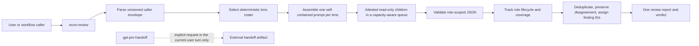
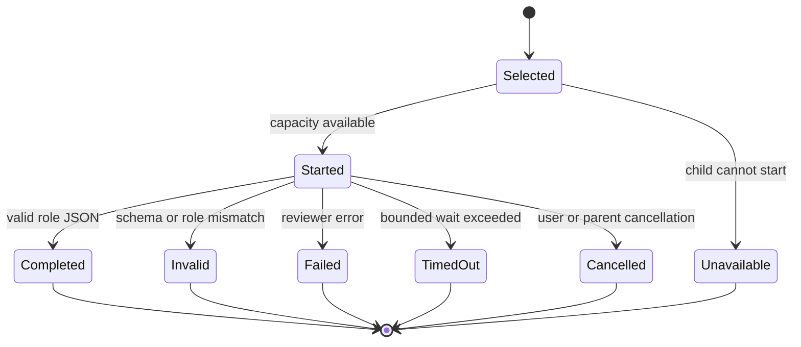
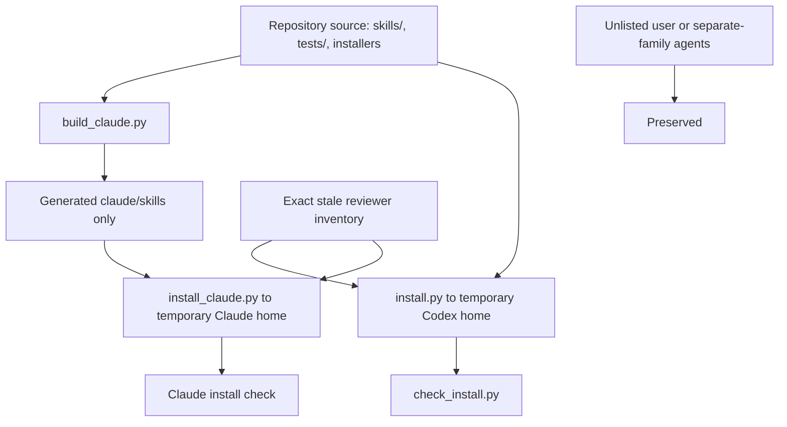

# Refactor `econ-review` around skill-local reviewer personas

## Summary

This plan replaces both historical reviewer implementations—the current catalogue of 17 registered specialist agents and the reviewed July design with one registered generic reviewer—with the current Compound Engineering pattern: one public review skill, a selective catalogue of skill-local persona prompts, and generic subagents assembled at runtime.

The target is deliberately not a compatibility patch. It adopts the simpler reviewed economics workflow while moving the review engine one step further:

- `econ-review` is the only public review interface and the sole owner of reviewer selection, dispatch, validation, synthesis, and verdicts.
- The economics review panel owns zero registered reviewer agents in Codex or Claude.
- Fifteen economics lenses remain available as non-discoverable prompt assets inside `econ-review`; only the lenses relevant to the review surface are selected.
- Core economics workflows never initiate or offer an external GPT handoff package. The independent `gpt-pro-handoff` skill remains available only when a user explicitly invokes it.
- Active workflow text is generic and contains no person-specific language.

The implementation should start from the reviewed July workflow behavior, not preserve the older standalone repository merely because it is already present. Migration safety is narrow: remove every known package-owned reviewer identity while preserving unrelated and separately developed agents.

---

## Goal Capsule

**Goal**

Ship a self-contained economics workflow whose public path is:

```text
brainstorm -> plan -> work -> review -> debug
```

and whose internal review path is:

```text
econ-review -> select lenses -> dispatch generic read-only reviewers
            -> validate role-scoped results -> synthesize one verdict
```

**Authority order**

1. The user-confirmed decisions in this plan.
2. Repository instructions in `AGENTS.md`.
3. The reviewed July workflow baseline at commit `7c29b30`.
4. The installed Compound Engineering 3.20 `ce-code-review` persona-dispatch pattern.
5. The older standalone implementation at commit `fea3f62`, used only as a migration inventory.

**Stop conditions**

Stop implementation and report the boundary if a proposed change would:

- mix SSJ, `create-project`, `econ-svg-fig`, or unrelated planning-document work into this branch;
- delete an agent or runtime file not named in the exact package-owned stale inventory;
- edit installed runtime copies instead of repository source;
- require rewriting historical plans or brainstorm records;
- silently install the branch into the live Codex runtime.

**Execution boundary**

Implement in repository source, regenerate derived Claude output, and verify both platforms in temporary homes. Installing into the live runtime remains a separate, explicit copy-install action after the branch is accepted.

---

## Problem Frame

The repository currently contains two incompatible simplification attempts:

1. The standalone branch exposes 17 registered reviewer agents. This retains detailed specialist instructions, but makes platform registration part of the economics architecture and leaves the main workflow coupled to a large agent catalogue.
2. The reviewed July baseline simplifies those specialists into one registered `econ_reviewer`. This improves the public workflow and the review contract, but still depends on a platform-registered reviewer and classifies the 17 specialist files as stale.

Neither is the desired endpoint. Current Compound Engineering review practice stores reviewer personas as references owned by the review skill, builds a self-contained prompt for each selected lens, and dispatches generic subagents. That design keeps specialization without making specialist identities part of the product surface.

The July baseline also retains workflow-initiated external handoff behavior across brainstorming, planning, work, and debugging. That conflicts with the desired control boundary: an external package is a user-chosen tool, not an automatic escalation stage.

Finally, some active workflow text contains person-specific instructions and some core skills depend on shared installed references outside their own skill directories. Both weaken portability and make the distributed workflow differ from the intended generic product.

---

## Product Requirements

### A. Public workflow and ownership

- **R1.** `econ-review` is the only user-facing economics review skill and the only component allowed to select reviewer lenses, dispatch reviewers, validate reviewer outputs, aggregate findings, or issue a review verdict.
- **R2.** Callers such as `econ-lfg` use a versioned inline caller envelope. They do not select individual reviewers or reinterpret raw reviewer payloads.
- **R3.** `econ-lfg` may own the later resolution loop, but it must preserve `econ-review` finding identities, review status, and unresolved disagreements.
- **R4.** Direct invocation and nested invocation through `econ-lfg` use the same roster-selection and verdict rules.

### B. Reviewer architecture

- **R5.** The core economics review panel owns zero registered persona-bearing reviewer agents in repository source, generated output, or a clean installed runtime. The 17 specialist registrations and the consolidated `econ_reviewer` registration are retired. A target host may contain exactly one package-owned `econ_review_readonly_transport` policy carrier when that host cannot impose a hard read-only boundary on a generic child at dispatch; the transport has no economics persona content or model/reasoning override.
- **R6.** `econ-review` contains exactly 15 canonical persona assets:
  1. provenance;
  2. specification;
  3. transformation and sample;
  4. estimation practice;
  5. inference;
  6. output consistency;
  7. claim discipline;
  8. output perception;
  9. code quality;
  10. design;
  11. dynamics;
  12. robustness;
  13. software equivalence;
  14. reproducibility;
  15. bundle.
- **R7.** Cross-language validation has no separate persona. Software equivalence owns comparison design, independent-path requirements, tolerance rules, object-before-numeric parity, and discrepancy classification; a cross-language trigger also selects transformation and sample plus reproducibility when data construction or rerun/environment parity is material. Hybrid/custom implementation has no separate persona. Code quality owns transparency, interface defaults, parameter plumbing, tests, and hidden machinery; estimation practice owns estimator and numerical implementation validity; affected obligations remain with transformation and sample, reproducibility, and output consistency.
- **R8.** Persona assets are references, not skills, commands, agents, or independently discoverable interfaces.
- **R9.** Each dispatched child receives a self-contained payload containing the common reviewer contract, exactly one persona, the relevant method guardrails, a bounded evidence manifest, and the versioned output schema. It must not depend on a runtime-relative agent file.
- **R10.** Generic reviewer subagents inherit the parent session model and reasoning configuration. The workflow does not assign model tiers by persona. Before deleting the retired registrations, implementation records a responsibility crosswalk from every substantive obligation in the 17 specialist prompts to one or more of the 15 personas or the common protocol; registration, model, and sandbox metadata are excluded from that semantic crosswalk.

### C. Selective routing and dispatch

- **R11.** `persona-catalog.md` defines deterministic selection for four base surfaces—`plan-design`, `implementation-code`, `empirical-results`, and `replication-handoff`—plus the independent `promotion` modifier. Multi-surface requests use the ordered union of every applicable surface core and every triggered conditional lens, deduplicated by the canonical R6 role order.
- **R12.** Quick review uses the quick core for each applicable surface. Standard review uses the standard core. Six roles are a context-and-cost target, not a truncation rule: a necessary role is never dropped to meet six. `full` means every applicable core and triggered lens, not all 15 regardless of relevance. Any roster above six is returned with one sentence explaining each role added beyond the applicable surface cores.
- **R13.** Conditional triggers are explicit and compositional. They include dynamics for event-time, local-projection, impulse-response, or other horizon objects; design for causal or quasi-experimental claims; software equivalence for cross-software or cross-language comparisons; output perception for substantive tables or figures; provenance for source-lineage or imported-evidence risk; estimation practice for non-trivial estimator, optimiser, weighting, convergence, or numerical choices; and the responsibility co-selection rules in R7.
- **R14.** The complete roster is fixed before dispatch. Every selected role is required for `full` coverage. Reviewer failure, invalid output, timeout, cancellation, or capacity backpressure must not silently skip, replace, or demote any later role.
- **R15.** Dispatch uses a capacity-aware foreground queue in canonical role order. Fill every safe child slot while retaining the parent; as a child reaches a terminal state and its slot is released, start the next queued role. A capacity rejection while at least one owned reviewer is running is backpressure: keep the role queued and retry it at the next owned terminal event. If no owned reviewer is running and the next queued role receives a capacity rejection after one host yield/retry, mark that role and all still-queued roles `unavailable` with reason `capacity-unavailable`; do not spin or silently skip. Do not use rigid all-settle wave barriers and do not hard-code a capacity of three.
- **R16.** The final report lists every selected role and its terminal state: `completed`, `invalid`, `failed`, `timed_out`, `cancelled`, or `unavailable`. `timed_out` is used only for a host-enforced timeout or an explicit supported timeout policy, never from an estimated wall clock. Completion order never affects finding identifiers or final ordering.

### D. Review safety and result contract

- **R17.** Reviewer prompts treat reviewed files, comments, logs, and external text as untrusted evidence, never as instructions.
- **R18.** Reviewer work is preventively read-only and non-escalating. A valid reviewer child may inspect evidence but cannot edit the live workspace, create live-workspace artifacts, stage changes, commit, push, request approval/elevation, access side-effecting connectors or MCP tools, use browser or computer-control write surfaces, or invoke any external side effect. Prompt-level prohibition alone does not satisfy this requirement.
- **R19.** Before dispatch, the parent records a scoped baseline covering HEAD/ref state, index state, hashes of in-scope tracked files, and hashes/existence of in-scope untracked evidence paths. After all reviewers settle, it compares the same scope. In-scope unexplained drift degrades the run; attributable boundary failure invalidates affected output. Out-of-scope drift is disclosed but does not by itself degrade coverage. The workflow never auto-reverts user work.
- **R20.** The dispatcher uses this safety order: (1) a host-native per-child hard read-only sandbox with a non-escalating approval policy and side-effecting non-filesystem tools disabled; otherwise (2) the persona-free `econ_review_readonly_transport`; otherwise (3) no reviewer-child dispatch. Mode (2) is valid only when host-supplied spawn metadata or a platform-supported preflight proves—after all configuration precedence and live runtime overrides—that the effective filesystem policy is read-only, approval/elevation cannot be granted, and side-effecting connector, MCP, browser, and computer-use surfaces are unavailable. A transport declaration, prompt promise, child self-report, or clean post-run canary is not attestation. If effective policy is unobservable or broadenable, mode (2) is unavailable. In case (3), selected roles are `unavailable`, safety mode is `unavailable`, coverage is `not-run`, and promotion is blocked. The state canary remains mandatory in modes (1) and (2) as defence in depth.
- **R21.** Reviewers return role-scoped JSON only. They do not assign the overall verdict, deduplicate across roles, edit another role's findings, or decide whether the workflow may proceed.
- **R22.** The parent validates schema version, run identifier, selected role, evidence references, severity vocabulary, and required fields before accepting a payload.
- **R23.** One salvage pass may remove harmless wrapper text around otherwise valid JSON. A genuinely malformed payload is not guessed into validity and marks only that role invalid.
- **R24.** The parent preserves genuine cross-role disagreement, assigns stable finding identifiers after deterministic sorting, and distinguishes findings, warnings, and review-process failures.
- **R25.** A run is `full` only when every selected role completes validly and every request-declared required supplemental assessment is accepted. Any selected role or required assessment that is missing, invalid, failed, timed out, cancelled, or unavailable makes the run `degraded`. A run with no valid selected role is `not-run`.
- **R26.** Coverage is immutable report evidence. A degraded or not-run review never returns `clean`, never passes a promotion gate, and cannot be relabelled by `econ-lfg`. A user may later issue a separate explicit promotion override, but the original report remains degraded or not-run and the override is recorded outside `econ-review`.

### E. External handoff boundary

- **R27.** `econ-brainstorm`, `econ-plan`, `econ-work`, `econ-review`, `econ-debug`, `econ-lfg`, `econ-compound`, their persona assets, output schemas, examples, menus, and generated counterparts neither offer, recommend, prepare, route to, nor automatically escalate to an external GPT handoff package.
- **R28.** Surprise memos, blockers, unresolved disagreements, anomalies, missing coverage, and failed review processes remain ordinary user-facing outputs within the active workflow.
- **R29.** `gpt-pro-handoff` activates only when the current user turn explicitly names the skill or unambiguously asks to create or use an external GPT Pro handoff package. A request originating from another skill, subagent, plan field, blocker, surprise memo, prior report, or imported package does not satisfy the gate; without the gate the auxiliary skill returns `not-invoked` and does not advertise itself.
- **R30.** Passive provenance may record that an externally supplied package was used, but that metadata cannot alter roster selection, create a recursive handoff, or add a handoff action to the final report. Any child recommendation to create another package is out of contract and is omitted while the underlying blocker is reported normally.

### F. Generic and portable distribution

- **R31.** Active skill text, generated skill text, command descriptions, metadata, examples, and distributed references contain no person-specific workflow wording.
- **R32.** Historical files under `docs/plans/` and `docs/brainstorms/` are evidence and are not rewritten for terminology cleanup.
- **R33.** Core reviewer protocol, personas, schema, and review guardrails live under `skills/econ-review/references/`.
- **R34.** `econ-work` owns its required research-code-quality and R-default references under `skills/econ-work/references/`; active core skills do not depend on a separately installed root reference directory.
- **R35.** If a reference must be duplicated between `econ-work` and `econ-review`, source parity is enforced by a test until a platform-supported composition mechanism exists.

### G. Migration and distribution

- **R36.** The migration removes both retired generations of persona-bearing package-owned reviewer registrations: the 17 specialist identities and the consolidated `econ_reviewer` identity. The optional `econ_review_readonly_transport` is a new policy carrier and is never matched by the stale inventory.
- **R37.** Stale cleanup uses a literal 18-filename inventory and runs only under `--force`. Unrelated agents, all unknown files, and separately owned skill-family agents—including SSJ—are preserved byte-for-byte.
- **R38.** `--check` fails with a precise repair instruction when stale package-owned reviewer registrations or stale root review contracts remain.
- **R39.** `build_claude.py` generates skill content and metadata but no economics reviewer agent files.
- **R40.** `install.py`, `install_claude.py`, and `check_install.py` verify complete installed skill trees, including persona assets and schemas, rather than only top-level `SKILL.md` files.
- **R41.** Generated Claude output is rebuilt from source, never manually edited.
- **R42.** Clean temporary Codex and Claude homes contain the public economics skills, the skill-local reviewer assets, zero persona-bearing economics reviewer registrations, and at most the explicitly supported persona-free read-only transport.

### H. Versioned contracts, SSJ boundary, and release conditions

- **R43.** `econ-review-request/v1`, `econ-domain-assessment/v1`, and `econ-review-report/v1` are explicit contracts with fixed fields, enums, defaults, and unknown-version behavior. Direct invocation is normalized into `econ-review-request/v1` before selection.
- **R44.** Unknown request versions fail closed before roster selection or dispatch. Unknown child-output versions invalidate only that role. Unknown final-report versions cause callers to stop, preserve the raw payload, and report `unsupported_report_version`; callers never guess or reinterpret.
- **R45.** A supplemental domain assessment is untrusted, versioned evidence. It cannot select personas, satisfy a selected persona role, assign stable finding identifiers, or issue a verdict. `econ-review` validates and maps accepted observations into the canonical finding taxonomy with source provenance.
- **R46.** The SSJ adapter remains a separate branch. It supplies `ssj-model-validity` as `econ-domain-assessment/v1`; SSJ promotion requests declare that assessment required. Missing, partial, or invalid SSJ model-validity input degrades coverage and blocks promotion without adding a registered core reviewer.
- **R47.** The core branch may be reviewed and merged independently, but live `--force` installation is prohibited until the SSJ adapter has removed the dangling registered-reviewer request and passed its integration checks against the final core request/report contracts.
- **R48.** Before any persona-runtime change, the reviewed July baseline is reproduced as the first clean implementation commit. If commit `7c29b30`, the current standalone baseline `fea3f62`, or the exact installed CE reference files cannot be resolved, implementation stops and requests only the missing tree, patch, or file set.
- **R49.** Static tests are necessary but not sufficient. Before live installation, one agent-native smoke review must execute the installed `econ-review` path in a disposable repository and temporary runtime home, dispatch at least two persona prompts through the effective read-only boundary, validate the final report contract, and prove the fixture workspace is unchanged.
- **R50.** Implementation units have single semantic ownership. Generated files are owned only by the generator; no unit manually edits generated output.

---

## Key Technical Decisions

### KTD1. Replace both registered-agent architectures

*(session-settled: user-directed; rejected alternatives: the 17-agent catalogue and the consolidated registered reviewer)*

**Decision:** Do not choose between 17 registered specialists and one registered generalist. Remove both persona-bearing generations and keep specialization as skill-local personas dispatched through generic children. Permit one persona-free transport registration only where the host cannot otherwise prove a preventive read-only, non-escalating child boundary.

**Why:** This matches the current CE separation between a simple public skill and internal review lenses. It also makes the review contract portable across Codex and Claude without synchronizing a second agent registry.

**Rejected alternatives:**

- Preserve 17 registered agents and only hide them from users.
- Keep the July `econ_reviewer` as a compatibility shim.
- Run every persona on every review.

### KTD2. Preserve the reviewed 15-lens economics taxonomy

**Decision:** Use the July role taxonomy as the canonical inventory, including its two deliberate identity folds. Cross-language obligations are distributed across software equivalence, transformation and sample, and reproducibility. Hybrid/custom implementation obligations are distributed across code quality, estimation practice, and any affected data, reproducibility, or output lenses.

**Why:** The taxonomy captures distinct empirical review obligations without retaining redundant registered identities. Role selection remains narrow and surface-specific.

### KTD3. Make `econ-review` self-contained

**Decision:** Store the persona catalogue, persona prompts, reviewer protocol, subagent template, output schema, and relevant code-quality guardrail inside `skills/econ-review/references/`.

**Why:** A dispatched reviewer should receive everything it needs from one skill version. Root-level installed contracts and agent-file lookups create hidden version coupling.

### KTD4. Enforce read-only behavior in layers

**Decision:** Require a preventively read-only, non-escalating effective child boundary. Prefer host-native per-child enforcement; otherwise use the persona-free transport only when host evidence attests the effective post-precedence policy. If neither path is provable, do not dispatch and return `not-run`. Keep the prompt contract, bounded evidence manifest, and pre/post state canary as defence in depth, and never auto-revert detected changes.

**Why:** Prompt rules and a clean post-run canary are detective controls and cannot prevent irreversible mutation. A narrow persona-free transport preserves the target semantic architecture while supplying a policy boundary on hosts that cannot enforce one directly.

### KTD5. Keep orchestration declarative

**Decision:** Express selection, dispatch, lifecycle, and validation in the skill contract and test their static invariants and representative fixtures. Do not introduce a new executable review framework in this refactor.

**Why:** The target CE pattern is agent-native orchestration, not a parallel Python service. Small JSON fixtures and contract tests provide useful drift protection without creating a second runtime.

### KTD6. Make external handoff strictly user-pulled

*(session-settled: user-directed; rejected alternative: workflow-initiated package offers or escalation)*

**Decision:** Remove all workflow-initiated handoff routes from the core economics skills. Keep the auxiliary handoff skill only as an explicit user-invoked capability.

**Why:** The user should choose when evidence leaves the active workflow and when an external opinion is worth the packaging cost. A blocker or surprise is information, not implicit authorization to start another workflow.

### KTD7. Clean only identities this package owns

**Decision:** Maintain the literal 18-name stale inventory for the 17 specialist registrations plus the consolidated registration, with deterministic Claude mappings and separate exact inventories for retired wrappers and moved root contracts. Preserve every unlisted agent and file byte-for-byte.

**Why:** The runtime can contain separately developed skills. “Zero reviewers” means zero registered reviewers owned by this core review panel, not deletion of unrelated specialist infrastructure.

### KTD8. Keep SSJ compatibility as a separate integration change

**Decision:** Do not add the SSJ model-validity reviewer to this core branch and do not delete its separately owned runtime registration. Define `econ-domain-assessment/v1` in core; require a separate SSJ branch to emit `ssj-model-validity` through that evidence contract. The core branch may merge independently, but live force-installation is blocked until the adapter passes integration checks.

**Why:** Repository instructions require SSJ work to remain reviewable separately. A versioned evidence contract lets core define the boundary without treating SSJ as a sixteenth reviewer or mixing SSJ implementation into this branch.

### KTD9. Distribute only generic workflow language

*(session-settled: user-directed; rejected alternative: person-specific instructions in active or generated workflow surfaces)*

**Decision:** Active source, metadata, examples, references, generated output, and runtime checks use role-neutral language. Historical planning and brainstorm records remain untouched.

**Why:** The repository is a reusable workflow product. Personal operating assumptions in distributed prompts change behavior for every user and make generated/runtime parity harder to reason about; historical evidence does not have that effect.

---

## High-Level Technical Design

### 1. Review component flow



`gpt-pro-handoff` is intentionally disconnected from the core review graph.

### 2. Skill-local reviewer assets

```text
skills/econ-review/
├── SKILL.md
├── agents/
│   └── openai.yaml
└── references/
    ├── persona-catalog.md
    ├── reviewer-protocol.md
    ├── reviewer-output-schema.json
    ├── subagent-template.md
    ├── research-code-quality.md
    ├── review_reference.md
    └── personas/
        ├── bundle.md
        ├── claim-discipline.md
        ├── code-quality.md
        ├── design.md
        ├── dynamics.md
        ├── estimation-practice.md
        ├── inference.md
        ├── output-consistency.md
        ├── output-perception.md
        ├── provenance.md
        ├── reproducibility.md
        ├── robustness.md
        ├── software-equivalence.md
        ├── specification.md
        └── transformation-sample.md
```

The skill-local tree also contains `review-request-schema.json`, `review-report-schema.json`, and `domain-assessment-schema.json` beside the existing reviewer-output schema.

No file in `references/personas/` has registration metadata. `econ-review` loads only selected persona files and embeds their content into each child prompt. The optional transport contains only the hard read-only policy, non-escalating approval policy, denial of side-effecting connector/MCP/browser/computer-use surfaces, model/reasoning inheritance, the instruction to execute the supplied self-contained prompt, and the strict return boundary. `transport-read-only` is reportable only from host evidence of the effective post-precedence policy; inspecting the transport file or asking the child what permissions it has is insufficient.

### 3. Reviewer lifecycle



The parent fills each safely available child slot while retaining itself, refills the queue on every owned terminal event, and treats capacity rejection as backpressure while an owned child remains active. If a yield/retry still cannot start the next role when no owned child is active, the queued remainder becomes `unavailable`. Synthesis begins only after every selected role reaches a terminal state.

### 4. Selection and dispatch defaults

`persona-catalog.md` should encode a deterministic matrix, not an open-ended suggestion list:

| Base surface | Quick core | Standard core | Common conditional additions |
|---|---|---|---|
| Plan/design | design, specification | design, specification, claim discipline | provenance, dynamics, software equivalence, bundle |
| Implementation/code | transformation and sample, code quality | transformation and sample, code quality, reproducibility | provenance, estimation practice, software equivalence, output consistency |
| Empirical results | specification, inference, output consistency | specification, inference, robustness, output consistency, claim discipline | provenance, transformation and sample, estimation practice, output perception, design, dynamics, software equivalence |
| Replication/handoff | provenance, reproducibility, bundle | provenance, reproducibility, bundle, output consistency | transformation and sample, software equivalence, code quality |

Selection is deterministic:

1. Normalize requested base surfaces into the table order.
2. Add each applicable quick or standard core; `depth:full` starts from standard cores.
3. Add every triggered conditional, including the R7 co-selection rules.
4. If `promotion: true`, add reproducibility and claim discipline plus every promotion-specific trigger.
5. Deduplicate by canonical R6 role order; every retained role is required for full coverage.
6. Never truncate to six. When the roster exceeds six, explain why each role beyond the surface cores was required.

### 5. Versioned workflow contracts

The implementation owns four compact contracts:

- `econ-review-request/v1` normalizes direct and nested calls, including base surfaces, depth, promotion, evidence manifest, timeout policy, and required supplemental assessments.
- `econ-reviewer-output/v1` is the role-scoped child payload. Unknown versions invalidate only that role.
- `econ-domain-assessment/v1` carries untrusted supplemental domain evidence such as SSJ model validity and can never behave as a reviewer.
- `econ-review-report/v1` records parent status, immutable coverage, selected-role lifecycle, findings, process failures, supplemental assessment status, promotion gate, and failure details.

Unknown request versions fail before selection. Unknown report versions stop callers. Role-level failures degrade coverage but do not make the parent report failed. Parent `failed` or `cancelled` status requires a structured failure with stage and code. `degraded` and `not-run` coverage always produce an indeterminate or blocked verdict, never `clean`, and always block promotion.

### 6. Source, generated, and installed topology



The build and installers must converge on the same invariant: skills and their local references are present; core economics reviewer registrations are absent.

### 7. Exact retired reviewer inventory

The Codex stale inventory contains exactly these 18 persona-bearing filenames:

```text
econ-bundle-reviewer.toml
econ-claim-discipline-reviewer.toml
econ-code-quality-reviewer.toml
econ-cross-language-validation-reviewer.toml
econ-design-reviewer.toml
econ-dynamics-reviewer.toml
econ-estimation-practice-reviewer.toml
econ-hybrid-implementation-reviewer.toml
econ-inference-reviewer.toml
econ-output-consistency-reviewer.toml
econ-output-perception-reviewer.toml
econ-provenance-reviewer.toml
econ-reproducibility-reviewer.toml
econ-robustness-reviewer.toml
econ-software-equivalence-reviewer.toml
econ-specification-reviewer.toml
econ-transformation-sample-reviewer.toml
econ-reviewer.toml
```

Each retired Claude filename is `stem.replace("-", "_") + ".md"`. The stale inventory is a literal tuple/set, never a prefix, suffix, glob, declared-name scan, or fuzzy match. `econ-review-readonly-transport.toml`, `econ_review_readonly_transport.md`, every `econ-ssj-*` file, and every unknown file are outside it. Retired public skill directories, wrappers, and moved root contracts use separate exact inventories.

---

## Implementation Units

U1 is the mandatory history gate and the first implementation commit. No U2-U9 source change begins before U1 is committed. Final semantic ownership is:

- U2: `skills/econ-review/references/**` persona, protocol, contract, schema, and crosswalk assets;
- U3: `skills/econ-review/SKILL.md`, its interface metadata, and the optional read-only transport policy;
- U4: all other active core skills plus `gpt-pro-handoff` activation behavior;
- U5: `skills/econ-work/references/**` and removal of active root-reference dependencies;
- U6: builders, installers, health checks, exact stale inventories, and generated output;
- U7: deterministic unit, contract, and migration tests and fixtures;
- U8: public repository documentation and release notes only;
- U9: agent-native smoke execution and the live-install/SSJ prerequisite check.

Generated files are changed only by U6's generator. A unit may consume another unit's contract but must not redefine or duplicate its source ownership.

### U1. Port the reviewed July core workflow as the behavioral baseline

- **Goal:** Replace older standalone workflow behavior with the reviewed July public workflow before applying the new persona-runtime changes.
- **Governs:** R1-R4 and the core-skill portions of R27-R32.
- **Files:** `skills/econ-brainstorm/SKILL.md`, `skills/econ-plan/SKILL.md`, `skills/econ-work/SKILL.md`, `skills/econ-work/references/execution_reference.md`, `skills/econ-debug/SKILL.md`, `skills/econ-lfg/SKILL.md`, `skills/econ-lfg/references/review_resolution_reference.md`, `skills/econ-compound/SKILL.md`, `skills/econ-compound/references/learning_schema.md`.
- **Approach:** Reproduce the reviewed July source from commit `7c29b30` as a clean baseline commit before persona-runtime changes. Preserve current repository improvements only when they do not reintroduce registered reviewer routing, person-specific workflow assumptions, or automatic external handoffs. Record the exact source tree used so the later semantic diff is auditable.
- **Test scenarios:** Core skill surfaces expose the intended five-stage workflow; nested review uses the same versioned envelope as direct review; no core skill selects a registered reviewer by name.
- **Verification:** Contract tests compare required headings, caller fields, allowed statuses, and cross-skill references rather than relying on whole-file snapshots.

### U2. Create the canonical skill-local persona and protocol assets

- **Goal:** Make `econ-review` self-contained and define one authoritative 15-lens catalogue.
- **Governs:** R6-R10, R17-R18, R21-R24, and R33.
- **Files:** `skills/econ-review/references/persona-catalog.md`, `reviewer-protocol.md`, `review-request-schema.json`, `reviewer-output-schema.json`, `review-report-schema.json`, `domain-assessment-schema.json`, `subagent-template.md`, `research-code-quality.md`, `review_reference.md`, `personas/*.md`, and `tests/fixtures/reviewer-responsibility-crosswalk.json`.
- **Approach:** Convert the reviewed role obligations into 15 compact persona prompts. Each persona declares remit, required checks, prohibited overreach, evidence expectations, and JSON contribution. Before deleting old files, enumerate every substantive check from the 17 specialist prompts in the responsibility crosswalk and map it to one or more persona/protocol sections; exclude only registration, model, and sandbox metadata. Apply the R7 multi-lens folds, remove agent-registration and runtime-path assumptions, and encode the request, child, domain-input, and report contracts.
- **Test scenarios:** Exactly 15 canonical persona files exist; each role resolves once; every old substantive obligation has at least one destination; folded-role obligations map to the multi-lens allocation in R7; retired roles have no persona or issue origin; every schema has a fixed version and rejects unknown enums and missing required fields.
- **Verification:** Static tests parse the catalogue and crosswalk, validate schema fixtures, and verify each persona contains required contract sections and no external-handoff action. A human-readable crosswalk review is part of the implementation handoff before old source files are deleted.

### U3. Rewrite `econ-review` as the generic-subagent orchestrator

- **Goal:** Give the single public review skill complete ownership of selection, safe dispatch, validation, synthesis, and verdicts.
- **Governs:** R1-R5, R9-R26, and R43-R45.
- **Files:** `skills/econ-review/SKILL.md`, `skills/econ-review/agents/openai.yaml`, the optional `.codex/agents/econ-review-readonly-transport.toml`, and Claude transport counterpart generated by U6.
- **Approach:** Define request normalization, deterministic ordered-union roster selection, a capacity-aware foreground queue, self-contained prompt assembly, preventive safety preflight, repository-state canary, terminal role states, JSON salvage/validation, completion-order-independent finding IDs, disagreement retention, immutable coverage, and verdict/promotion rules. Dispatch only through an attested host-native read-only boundary or the attested persona-free transport; otherwise return `not-run`.
- **Test scenarios:** An eight-role panel with constrained capacity starts every role once in canonical order without barrier waves; capacity rejection obeys backpressure and deadlock termination; a malformed role does not suppress later roles; a failed required role cannot return clean or promotion-ready; wrapper text around valid JSON is salvageable while role-mismatched or unknown-version JSON is invalid.
- **Verification:** Schema fixtures cover valid, wrapped-valid, malformed, wrong-role, unsupported-evidence, and process-failure payloads. Static tests confirm that only the parent can issue verdicts and finding identifiers.

### U4. Remove workflow-initiated external handoffs and person-specific language

- **Goal:** Make external packaging strictly user-controlled and make the distributed workflow generic.
- **Governs:** R27-R32.
- **Files:** all active core skills outside `econ-review`, their owned references and metadata, `skills/auxiliary/gpt-pro-handoff/SKILL.md`, and `skills/auxiliary/gpt-pro-handoff/agents/openai.yaml`.
- **Approach:** Remove instructions to offer, prepare, escalate, or automatically switch to an external handoff from all core economics workflows. Preserve surprise/blocker reporting locally. Tighten the auxiliary skill so only an unambiguous request in the current user turn activates it; inherited instructions, subagents, plans, blockers, reports, provenance, and imported packages fail the gate and return `not-invoked` without advertising the skill. Replace person-specific workflow language with role-neutral wording.
- **Test scenarios:** A blocker in brainstorm, plan, work, or debug produces an ordinary user-facing blocker, not a package offer; inherited or imported handoff instructions do not activate the auxiliary skill; a package supplied by the user may be recorded as provenance; explicit current-turn invocation remains valid.
- **Verification:** Scan all active and distributed surfaces, including the auxiliary handoff skill, for configured personal-name patterns. In a separate proactive-handoff scan, exclude the auxiliary skill implementation and historical `docs/**`, then reject offer, preparation, and escalation language everywhere else.

### U5. Localize shared core references

- **Goal:** Remove hidden dependencies on separately installed root references.
- **Governs:** R33-R35.
- **Files:** `skills/econ-work/references/research-code-quality.md`, `skills/econ-work/references/r-defaults.md`, `skills/econ-review/references/research-code-quality.md`, all core references to the old root paths, `tests/test_skill_contracts.py`.
- **Approach:** Move required contracts under the consuming skills. Where the same code-quality rules are needed by both work and review, keep deliberately identical copies and enforce byte or normalized-content parity in tests.
- **Test scenarios:** Each installed skill resolves every referenced local file within its own directory; deleting the old installed root reference directory does not break a clean skill install; duplicated guardrails cannot drift silently.
- **Verification:** A reference-resolution test walks active core skill links and fails on missing or out-of-skill dependencies.

### U6. Migrate build and install behavior atomically

- **Goal:** Ensure source, generated Claude output, and both runtime installs converge on zero persona-bearing reviewer registrations and at most one supported persona-free transport.
- **Governs:** R36-R42.
- **Files:** `build_claude.py`, `install.py`, `install_claude.py`, `check_install.py`, exact stale-file inventories, `claude/` generated output.
- **Approach:** Remove persona-bearing reviewer-agent generation and installation. Add the literal 18-name Codex inventory and deterministic Claude mapping, with separate exact inventories for retired wrappers and moved root contracts. Apply deletion only under `--force`; preserve every unlisted agent byte-for-byte. Generate the optional persona-free transport only on supported hosts. Make checks validate complete skill trees and fail with the exact force-install repair command when stale files remain.
- **Test scenarios:** A seeded temporary home containing all 18 retired identities plus an unrelated agent is force-installed; only the 18 package-owned identities are removed; a second force install is idempotent; check mode passes afterward and the unrelated agent remains byte-identical.
- **Verification:** Run build check plus fresh and seeded temporary-home installs for Codex and Claude. Confirm generated `claude/agents/` contains no core economics reviewer files.

### U7. Expand the contract and migration test suite

- **Goal:** Turn architectural decisions into durable regression tests.
- **Governs:** Verification of R5-R50, with focused fixtures for R7-R26, contract coverage for R43-R47, and migration coverage for R36-R42.
- **Files:** `tests/test_skill_contracts.py`, `tests/test_review_contracts.py`, `tests/test_install_contracts.py`, `tests/fixtures/reviewer_payloads/*.json`.
- **Approach:** Port the reviewed July tests, invert their consolidated-agent expectations, and add persona/crosswalk, ordered routing, queue safety, versioned contracts, safety-preflight, current-turn handoff, generated-parity, and exact-cleanup coverage. Use temporary directories for installation tests.
- **Test scenarios:** Cover the full requirements matrix: canonical persona inventory and responsibility preservation, compositional role folds, deterministic ordered-union routing, queue backpressure/deadlock, schema versions and failure semantics, immutable coverage, preventive safety requirements, indirect-handoff rejection, generic-language scan, complete installed trees, literal stale cleanup, SSJ/unrelated-agent preservation, and generated freshness.
- **Verification:** The complete standard-library test suite passes without a live Codex/Claude install or model call.

### U8. Document the migration and public workflow

- **Goal:** Deliver a reviewable cross-platform source tree and make the live-runtime step explicit.
- **Governs:** R31-R32 and R36-R42.
- **Files:** `README.md`, `AGENTS.md`, and public release/migration notes.
- **Approach:** Describe one review skill with internal personas, document the explicit post-merge install/restart boundary, identify the separate SSJ adapter prerequisite, and state that generated output belongs to U6.
- **Test scenarios:** Generated skills contain the same 15 persona assets and contract version as source; no generated reviewer agent registrations exist; public docs do not tell users to choose among lenses or trigger an external package.
- **Verification:** Public documentation matches the contracts and release boundary; the repository diff contains no manual generated edits.

### U9. Prove the agent-native runtime path

- **Goal:** Exercise the installed review workflow through a real safe child boundary before any live installation.
- **Governs:** R20, R25-R26, and R47-R49.
- **Files:** `tests/run_agent_native_smoke.py`, disposable smoke fixtures, and smoke documentation.
- **Approach:** Install into a temporary runtime home, create a disposable repository, attest `host-read-only` or `transport-read-only`, dispatch at least two persona prompts, validate `econ-review-report/v1`, and compare byte-level pre/post fixture state. The smoke must also prove no handoff action appears. Another host is not declared release-ready until its equivalent smoke passes.
- **Test scenarios:** Safe dispatch returns the expected selected roster and valid report; missing safety attestation returns `not-run`; one invalid child degrades coverage; fixture bytes remain unchanged; missing required SSJ assessment blocks promotion; no inherited context activates `gpt-pro-handoff`.
- **Verification:** `python tests/run_agent_native_smoke.py --host codex --checkout .` passes in a disposable environment. Live `--force` installation remains prohibited until the separate SSJ adapter passes final contract integration.

---

## System-Wide Impact

### Public interfaces

- The public skill registry stays small: users see `econ-review`, not the internal lens catalogue.
- `econ-review` metadata remains the single review entry point on both Codex and Claude.
- `gpt-pro-handoff` remains separately discoverable, but its description and trigger make explicit user intent a precondition.

### Workflow interfaces

- `econ-lfg` and any future caller send a versioned review envelope describing the review surface, evidence boundary, requested depth, and promotion status.
- `econ-review` returns one versioned report containing coverage state, selected-role lifecycle, findings, disagreements, and verdict.
- Raw child payloads are internal to `econ-review`; callers never consume them directly.

### Prompt and context boundaries

- Each child prompt is assembled from an immutable common contract, one selected persona, relevant local guardrails, and a bounded evidence manifest.
- The parent does not expose unrelated repository context merely because the child shares the workspace.
- Reviewed artifacts are explicitly marked as untrusted evidence so embedded instructions cannot redefine the reviewer task.

### State and failure propagation

- Review state progresses from roster selection through wave dispatch to terminal role states and final coverage classification.
- One role's invalid output degrades coverage for that role but does not cancel later waves.
- Repository drift and unavailable capacity are visible in process status. Missing safety attestation prevents dispatch and returns `not-run`; none of these states is silently converted into a clean review.
- `econ-lfg` receives the final coverage classification and cannot upgrade a degraded promotion verdict.

### Build and runtime surfaces

- Source skills, generated Claude skills, fresh installs, and upgraded installs must contain the same persona and schema versions.
- The old registered-agent paths become migration-only inputs. No active skill or generated file may depend on them.
- Force-install cleanup removes exact package-owned stale files; check mode is diagnostic and non-mutating.
- A live install remains intentionally decoupled from source development so uncommitted branch work cannot silently become the runtime workflow.

### Human control and approvals

- Lens selection is automatic and explainable; users do not have to choose among 15 internal roles.
- External handoff creation is a separate user-authorized action.
- Reviewers are prohibited from mutating the workspace; detected mutation invalidates affected output and degrades the run without auto-revert.
- A user must explicitly accept missing coverage before a degraded promotion review can be treated as sufficient.

---

## Acceptance Examples

- **AE1 — Standard empirical review:** Given an empirical results package with a dynamic event-study figure, `econ-review` selects the standard results core plus dynamics and output perception, explains any role beyond the applicable cores, dispatches through the capacity-aware queue, and returns one report containing every selected role's state.
- **AE2 — Cross-language migration:** Given an R-to-Python replication request, `econ-review` selects software equivalence and relevant data/reproducibility lenses. It never selects a separate cross-language reviewer.
- **AE3 — Custom estimator:** Given hidden custom numerical machinery, code quality checks transparency and plumbing while estimation practice checks numerical and estimator validity; affected data, reproducibility, and output lenses are co-selected. No hybrid reviewer identity is registered or dispatched.
- **AE4 — Partial reviewer failure:** Given six required roles and one invalid JSON payload, the remaining roles still complete, the invalid role is shown explicitly, the run is degraded, and a promotion-ready verdict is prohibited.
- **AE5 — Read-only violation:** Given repository state changes during a review, the parent reports the drift, invalidates an attributable violating payload, degrades the panel, and never auto-reverts the workspace.
- **AE5b — Safety unavailable:** Given a host cannot attest an effective read-only, non-escalating child boundary, no persona is dispatched, coverage is `not-run`, and promotion is blocked.
- **AE6 — User-controlled handoff:** Given an unresolved blocker in `econ-work`, the workflow reports the blocker and stops or awaits direction. It does not offer an external package. Given a separate explicit request for `gpt-pro-handoff`, that auxiliary skill still builds the requested artifact.
- **AE7 — Safe migration:** Given a temporary runtime containing the 17 specialist agents, the consolidated agent, and an unrelated agent, force install removes exactly the package-owned 18 and preserves the unrelated file.
- **AE8 — Clean cross-platform distribution:** Given a fresh checkout, the generator and both temporary-home installers produce complete skill-local persona trees, no persona-bearing reviewer registrations, and at most the supported persona-free transport.

---

## Scope Boundaries

### In scope

- The reviewed core economics workflow: brainstorm, plan, work, review, debug, LFG, compound.
- The complete `econ-review` persona runtime and result contract.
- Explicit user-only activation of the existing auxiliary GPT handoff skill.
- Generic active/distributed workflow language.
- Core reference localization.
- Codex and Claude build/install/check behavior.
- Contract, fixture, migration, and generated-parity tests.
- Exact cleanup of the two retired core reviewer-registration generations.

### Out of scope

- Rewriting historical files in `docs/plans/` or `docs/brainstorms/`.
- Changing the substantive SSJ, `create-project`, `econ-svg-fig`, or `econ-plots` skill families.
- Registering an SSJ persona in the core review catalogue.
- Deleting unknown or separately owned runtime agents.
- Replacing `gpt-pro-handoff` internals beyond its explicit-invocation boundary.
- Adding an executable review service, persistent review database, or cross-session scheduler.
- Installing this branch into the live runtime before it is reviewed and explicitly selected.

### Required follow-on integration

The separately developed SSJ workflow currently requests a model-validity reviewer that the core catalogue does not expose. The core branch defines `econ-domain-assessment/v1` and preserves the existing SSJ agent/file during cleanup. A separate SSJ branch must replace the dangling request with an `ssj-model-validity` assessment and pass the final core contract tests. The core branch may merge first, but no live `--force` installation is allowed until that adapter is accepted.

---

## Risks and Mitigations

- **Generic child permissions may be broader than registered-agent permissions.** Require attested host-native enforcement or the attested persona-free transport. Without either, do not dispatch. Keep prompt restrictions and the state canary as defence in depth.
- **Concurrent workspace edits can look like reviewer mutation.** Report unattributed drift as a degraded safety condition rather than assigning blame or deleting changes.
- **Exact stale cleanup can miss a historical spelling.** Build the inventory from both the standalone and July generations, test every filename on both platforms, and never broaden cleanup to globs.
- **Exact stale cleanup can delete separate-family agents if ownership is ambiguous.** Include only core review identities proven to be package-owned; preserve the SSJ agent and every unknown file.
- **Duplicated local guardrails can drift.** Keep duplication minimal and make parity a contract test.
- **Generated output can hide manual edits.** Rebuild from source and require `build_claude.py --check` to pass in a clean tree.
- **A malformed reviewer can distort the parent synthesis.** Validate role and schema before accepting content; do not infer missing findings from malformed text.
- **A large panel can consume all child capacity.** Retain the parent slot, refill from the canonical queue on terminal events, treat capacity rejection as backpressure, and use the idle-capacity termination rule instead of rigid waves.
- **Installed skills can remain stale after a correct source change.** Treat live install and application restart as explicit post-acceptance steps and report which checkout was installed.

---

## Verification Contract

Implementation is not complete until all of the following pass from the repository checkout:

1. **Source and contract tests**

   ```powershell
   python -m unittest discover -s tests -v
   ```

2. **Generated Claude parity**

   ```powershell
   python build_claude.py --check
   ```

3. **Fresh temporary Codex install**

   - Install with `python install.py --codex-home <temporary-home> --force`.
   - Run `python install.py --codex-home <temporary-home> --check`.
   - Assert all core skill-local references exist, no persona-bearing reviewer registration exists, and any transport contains policy only.

4. **Seeded temporary Codex migration**

   - Seed all 18 retired reviewer files, a stale root review contract, and an unrelated sentinel agent.
   - Force install twice.
   - Assert exact stale removal, idempotence, sentinel byte preservation, and passing check mode.

5. **Fresh and seeded temporary Claude installs**

   - Repeat the corresponding install/check/migration assertions with `install_claude.py`.
   - Assert generated and installed Claude agent directories contain no persona-bearing economics reviewer registrations.

6. **Persona and routing contracts**

   - Assert exactly 15 persona files and one-to-one catalogue resolution.
   - Assert the responsibility crosswalk covers every substantive obligation and the two folds co-select the correct lenses.
   - Assert stable base-surface cores, promotion-as-modifier, ordered unions, and deterministic conditional priority.
   - Assert six is an explanation threshold, not a cap.
   - Assert queue backpressure, refill, and idle-capacity termination without skipped roles.

7. **Payload and verdict contracts**

   - Validate request, child-output, domain-assessment, and report fixtures, including unknown versions, malformed/wrong-role payloads, unsupported evidence, timeout policy, and parent failure semantics.
   - Assert only `econ-review` assigns final finding IDs and verdicts.
   - Assert degraded promotion cannot produce a promotion-ready verdict.

8. **Safety and language contracts**

   - Assert reviewer prompts prohibit mutation and require untrusted-evidence handling, but never count prompts or self-report as safety attestation.
   - Assert unprovable safety returns `not-run` without dispatch.
   - Assert the parent contract requires a pre/post scoped state comparison and forbids auto-revert.
   - Scan active/distributed surfaces for configured personal-name patterns.
   - Outside historical `docs/**`, reject core or child language that offers, prepares, or escalates to an external handoff package.
   - Assert the auxiliary skill activates only from an explicit current-user-turn request and rejects inherited/non-user origins.

9. **Agent-native smoke gate**

   - Run `python tests/run_agent_native_smoke.py --host codex --checkout .` in a disposable repository and temporary runtime home.
   - Dispatch at least two persona prompts through `host-read-only` or `transport-read-only`.
   - Validate `econ-review-report/v1`, expected roster/coverage, no handoff action, and byte-identical pre/post fixture hashes.
   - Do not declare another host release-ready until its equivalent smoke passes.

10. **Diff boundary**

   - Confirm the implementation diff does not modify historical plan/brainstorm records or unrelated skill families.
   - Confirm no installed runtime path appears as a source edit.

No live runtime installation is part of verification. The core branch may merge independently, but `python install.py --force` remains prohibited until the separate SSJ adapter passes the final request/report integration checks. After that prerequisite and explicit acceptance, install from the exact checkout, restart Codex, and run `python check_install.py`.

---

## Definition of Done

- One public `econ-review` skill owns the complete review flow.
- Exactly 15 canonical skill-local personas exist and no persona-bearing economics reviewer agents are registered.
- The responsibility crosswalk proves that cross-language and hybrid duties survive their multi-lens folds.
- Reviewer prompts are self-contained, role-scoped, and schema-bound; dispatch is preventively read-only and non-escalating or does not run.
- Selection, capacity-aware queueing, role lifecycle, immutable coverage, and promotion gating are deterministic and documented.
- Request, child-output, domain-assessment, and final-report contracts are versioned and tested.
- Core economics workflows never initiate or offer an external GPT handoff package.
- The standalone handoff skill requires explicit authorization in the current user turn and rejects inherited activation.
- Active/distributed workflow surfaces are generic.
- Core skills resolve required references locally.
- Both retired reviewer-registration generations are removed exactly while unrelated agents are preserved.
- Source, generated Claude output, fresh installs, seeded migrations, and contract tests agree.
- The agent-native smoke gate proves effective safety, real child/report behavior, no handoff action, and byte-identical fixture state.
- The core branch does not modify SSJ or other separately scoped skill families.
- The SSJ adapter prerequisite and live-install/restart boundary are documented and have not been crossed implicitly.

---

## Sources and Research

- Reviewed July workflow baseline, commit `7c29b30`.
- Current standalone repository baseline, commit `fea3f62`.
- Installed Compound Engineering 3.20 `ce-code-review` references: `persona-catalog.md`, `dispatch-reviewers.md`, `subagent-template.md`, and `references/personas/`.
- Compound Engineering repository: https://github.com/EveryInc/compound-engineering-plugin
- Compound Engineering review persona catalogue: https://github.com/EveryInc/compound-engineering-plugin/blob/main/plugins/compound-engineering/skills/ce-code-review/references/persona-catalog.md
- Repository source/runtime rules in `AGENTS.md`.
